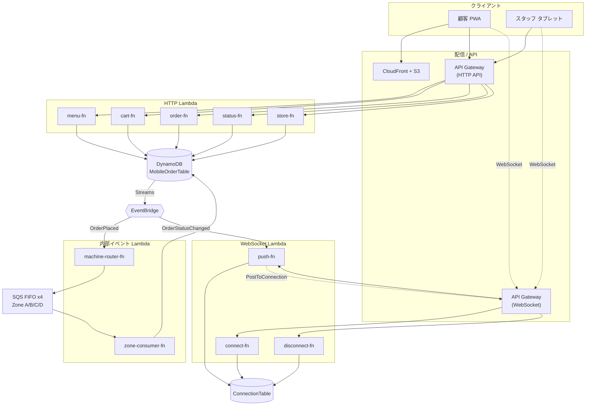
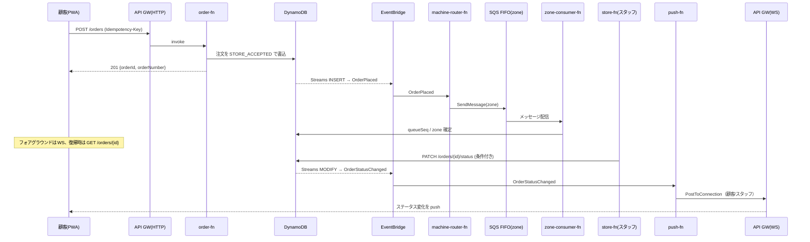

# アーキテクチャ設計書 — カフェ向けモバイルオーダーアプリ

**バージョン**: 1.0
**作成日**: 2026-07-02
**関連文書**: `requirements.md`（要件定義書）
**対象読者**: 実装担当（中級者想定）

本書は Lambda 関数のインターフェース設計を中心に、AWS サーバーレス構成の全体像を定義する。要件は `requirements.md` を正とし、本書はその実装契約（入出力の型）を規定する。

---

## 1. 全体アーキテクチャ



---

## 2. Lambda 一覧（確定構成）

| # | 関数名 | トリガー | 認証 | 役割 |
|---|---|---|---|---|
| 1 | `menu-fn` | HTTP API | なし | メニュー一覧・商品詳細 |
| 2 | `cart-fn` | HTTP API | なし | カート CRUD |
| 3 | `order-fn` | HTTP API | なし | 注文確定・キャンセル |
| 4 | `status-fn` | HTTP API | なし | ステータスポーリング・キュー位置 |
| 5 | `store-fn` | HTTP API | Cognito | 注文一覧・ステータス更新 |
| 6 | `connect-fn` | WebSocket `$connect` | なし | connectionId 保存 |
| 7 | `disconnect-fn` | WebSocket `$disconnect` | なし | connectionId 削除 |
| 8 | `push-fn` | EventBridge（主）/ `$default`（スタブ） | — | クライアントへ WebSocket push |
| 9 | `machine-router-fn` | EventBridge（`OrderPlaced`） | — | ゾーン判定 → SQS FIFO へ振り分け |
| 10 | `zone-consumer-fn` | SQS FIFO ×4 | — | 受付順確定・ETA 基準記録 |
| (将来) | `payment-fn` | HTTP API | — | 決済 Webhook（雛形のみ） |

---

## 3. インターフェースはトリガーで3種類に分かれる

Lambda の「インターフェース」の外殻は、受け取る AWS イベント型で決まる。混在させず 3 分類で設計する。

| 種別 | 関数 | Go ハンドラ型（aws-lambda-go） |
|---|---|---|
| **HTTP API** | menu / cart / order / status / store | `events.APIGatewayV2HTTPRequest` → `events.APIGatewayV2HTTPResponse` |
| **WebSocket API** | connect / disconnect / push(`$default`) | `events.APIGatewayWebsocketProxyRequest` → `events.APIGatewayProxyResponse` |
| **内部イベント** | machine-router / push | `events.EventBridgeEvent`（detail をカスタム型でパース） |
| **内部イベント** | zone-consumer | `events.SQSEvent` |

---

## 4. 設計原則：アダプタ層 / ドメイン層の分離

各 Lambda は「AWS イベントに依存する外殻」と「非依存のドメインロジック」を分離する。ドメイン層が本質的なインターフェースであり、単体テスト対象となる。

```go
// ① 外殻アダプタ（AWS 依存。薄く保つ）
func main() { lambda.Start(route) }

func route(ctx context.Context, req events.APIGatewayV2HTTPRequest) (events.APIGatewayV2HTTPResponse, error) {
    switch req.RouteKey { // 例: "POST /cart/{sessionId}/items"
    case "GET /cart/{sessionId}":
        return adaptJSON(cart.Get)(ctx, req)
    case "POST /cart/{sessionId}/items":
        return adaptJSON(cart.AddItem)(ctx, req)
    // ...
    default:
        return notFound(), nil
    }
}

// ② ドメイン層（AWS 非依存。ここが「インターフェース」の本体）
func AddItem(ctx context.Context, in AddItemInput) (Cart, error)
```

- **1 関数 = 1 ドメイン**。cart-fn は 4 ルートを内部の RouteKey ディスパッチで処理する（過分割を避ける）。
- `adaptJSON` はボディの JSON デコード・パスパラメータ抽出・レスポンスの JSON エンコード・エラー→HTTP 変換を共通化するヘルパ。

---

## 5. 共通契約

### 5.1 エラーエンベロープ（全 HTTP Lambda 共通）

```json
{ "error": { "code": "VALIDATION_ERROR", "message": "quantity exceeds maximum (10)", "requestId": "..." } }
```

| code | HTTP | 用途 |
|---|---|---|
| `VALIDATION_ERROR` | 400 | enum 違反・個数上限・必須欠落 |
| `UNAUTHORIZED` | 401 | Cognito JWT 無効（Staff API） |
| `NOT_FOUND` | 404 | 商品・注文が存在しない |
| `CONFLICT` | 409 | 状態遷移違反・冪等キー衝突・楽観ロック失敗 |
| `TOO_MANY_REQUESTS` | 429 | スロットリング |
| `INTERNAL` | 500 | 想定外エラー |

### 5.2 共通の値オブジェクト

```json
// variant（温度 + サイズ）。itemId = "{productId}#{temperature}#{size}"
{ "temperature": "hot | iced", "size": "S | M | L" }
```

---

## 6. HTTP Lambda 契約

### 6.1 menu-fn

```
GET /menu               → 200 MenuResponse
GET /menu/{productId}   → 200 Product | 404
```

```json
// Product
{ "productId": "prod-001", "category": "espresso", "name": "カフェラテ",
  "basePrice": 450, "sizeDelta": { "S": 0, "M": 50, "L": 100 },
  "allowHot": true, "allowIced": true, "available": true }

// MenuResponse
{ "categories": [ { "category": "espresso", "products": [ /* Product */ ] } ] }
```

> `GET /menu/{productId}` は全メニューを取得し該当商品を返す（category 不要）。

### 6.2 cart-fn

```
GET    /cart/{sessionId}                 → 200 Cart
POST   /cart/{sessionId}/items           → 201 Cart      body: AddItemInput
PUT    /cart/{sessionId}/items/{itemId}  → 200 Cart      body: { "quantity": 3 }
DELETE /cart/{sessionId}/items/{itemId}  → 204
```

```json
// AddItemInput（unitPrice/lineTotal はサーバーが算出。クライアント値は無視）
{ "productId": "prod-001", "category": "espresso",
  "variant": { "temperature": "iced", "size": "M" }, "quantity": 2 }

// Cart
{ "sessionId": "sess-abc",
  "items": [ { "itemId": "prod-001#iced#M", "productId": "prod-001", "name": "カフェラテ",
    "variant": { "temperature": "iced", "size": "M" },
    "quantity": 2, "unitPrice": 500, "lineTotal": 1000 } ],
  "subtotal": 1000 }
```

### 6.3 order-fn

```
POST  /orders                   → 201 Order   header: Idempotency-Key   body: { "sessionId": "...", "storeId": "..." }
PATCH /orders/{orderId}/cancel  → 200 Order | 409（STORE_ACCEPTED 以外）
```

```json
// Order
{ "orderId": "ord-xyz", "orderNumber": 42, "storeId": "store-01",
  "status": "STORE_ACCEPTED", "totalPrice": 1280,
  "lines": [ { "productId": "prod-001", "name": "カフェラテ",
    "variant": { "temperature": "iced", "size": "M" }, "quantity": 2, "unitPrice": 500 } ],
  "createdAt": "2026-07-02T12:03:00Z" }
```

- 注文はサーバー側カート（sessionId）から生成し、金額を再計算する。
- `Idempotency-Key` を DynamoDB に記録し、同一キーの再送には同じ Order を返す。
- **order-fn は SQS も EventBridge も直接呼ばない**。DynamoDB へ `STORE_ACCEPTED` で書くのみ。後続は Streams → EventBridge が駆動する。

### 6.4 status-fn

```
GET /orders/{orderId}                 → 200 OrderStatus
GET /orders/{orderId}/queue-position  → 200 QueuePosition
```

```json
// OrderStatus
{ "orderId": "ord-xyz", "orderNumber": 42, "status": "PREPARING", "updatedAt": "2026-07-02T12:05:00Z" }

// QueuePosition
{ "orderId": "ord-xyz", "zone": "B", "position": 3, "estimatedWaitMinutes": 6 }
```

### 6.5 store-fn（Cognito 認証）

```
GET   /stores/{storeId}/orders?status=STORE_ACCEPTED → 200 { "orders": [ OrderCard ] }
PATCH /orders/{orderId}/status                 → 200 Order | 409   body: { "fromStatus": "STORE_ACCEPTED", "toStatus": "PREPARING" }
```

- 認証は `req.RequestContext.Authorizer.JWT.Claims` から取得。
- PATCH は **状態遷移を条件付き書き込みで検証**する（`fromStatus` を条件式に含め、二重スワイプ・競合を 409 で弾く）。§5.4 のアンドゥ確定時における唯一の書き込み点。
- 遷移規則: `STORE_ACCEPTED → PREPARING → READY_PICKUP → HANDED_OVER`（それ以外は 409）。

---

## 7. WebSocket Lambda 契約

```go
func handle(ctx context.Context, req events.APIGatewayWebsocketProxyRequest) (events.APIGatewayProxyResponse, error)
```

| 関数 | ルート | 入力 | 動作 |
|---|---|---|---|
| connect-fn | `$connect` | クエリ `?orderId=`（顧客）/ `?zone=`（スタッフ）+ `connectionId` | ConnectionTable に保存（TTL 2h） |
| disconnect-fn | `$disconnect` | `connectionId` | ConnectionTable から削除 |
| push-fn(`$default`) | `$default` | クライアント送信メッセージ | 当面スタブ（将来のクライアント→サーバー通信用） |

`ConnectionTable`: PK=`connectionId`, SK=`orderId`（顧客）/ `ZONE#<zone>`（スタッフ）, TTL=2h。

---

## 8. 内部イベント Lambda 契約

非同期系の「インターフェース」＝ **EventBridge の detail スキーマ**。ここを固定すれば書き込み側と消費側が疎結合になる。

### 8.1 EventBridge イベント（DynamoDB Streams 起点）

```json
// detail-type: "OrderPlaced"（Streams INSERT）
{ "orderId": "ord-xyz", "storeId": "store-01", "orderNumber": 42,
  "lines": [ { "productId": "prod-001", "category": "espresso",
    "temperature": "iced", "size": "M", "quantity": 2 } ] }

// detail-type: "OrderStatusChanged"（Streams MODIFY）
{ "orderId": "ord-xyz", "storeId": "store-01", "zone": "B",
  "oldStatus": "STORE_ACCEPTED", "newStatus": "PREPARING", "changedAt": "2026-07-02T12:05:00Z" }
```

### 8.2 machine-router-fn

- 入力: `OrderPlaced`。
- 処理: 明細ごとにゾーン判定（エスプレッソ系×L/M/S → A/B/C、非エスプレッソ → D）→ 対応ゾーンの SQS FIFO へ `SendMessage`（`MessageGroupId = zone`、`MessageDeduplicationId = orderId+lineIndex`）。
- 出力: なし。

### 8.3 push-fn

- 入力: `OrderStatusChanged`。
- 処理: ConnectionTable を引き、対象 orderId の顧客と担当 zone のスタッフの connectionId へ API Gateway Management API `PostToConnection` で新ステータスを push。
- 出力: なし（送信失敗＝切断済みは ConnectionTable から掃除）。

### 8.4 zone-consumer-fn（SQS FIFO ×4）

```go
func handle(ctx context.Context, ev events.SQSEvent) error
```

- 入力: 各ゾーン FIFO のメッセージ（`{ orderId, zone, lineIndex }`）。
- 処理:
  1. DynamoDB の該当注文 `status` を確認。`CANCELLED` ならスキップ（§7.3）。
  2. ゾーン内の受付順（キュー位置）を確定し、注文レコードへ `zone` と `queueSeq` を書き込む。
  3. ETA 算出用の基準（ゾーン別 EMA の入力）を更新する。
- FIFO 保証: `MessageGroupId = zone` によりゾーン内で厳密順序処理。

---

## 9. 注文フロー全体（シーケンス）



---

## 10. インターフェース設計チェックリスト

- [ ] 全 HTTP エンドポイントが RouteKey ディスパッチで 5 関数に収まる
- [ ] ドメイン層関数が AWS 型に非依存（単体テスト可能）
- [ ] エラーは共通エンベロープに統一
- [ ] order-fn は同期書き込みのみ（非同期は Streams→EventBridge に委譲）
- [ ] EventBridge detail スキーマ（OrderPlaced / OrderStatusChanged）が固定
- [ ] zone-consumer-fn が CANCELLED をスキップ（§7.3 準拠）
- [ ] store-fn の PATCH が条件付き書き込みで遷移を検証
