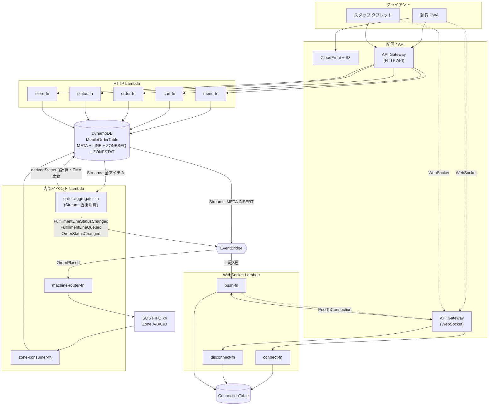
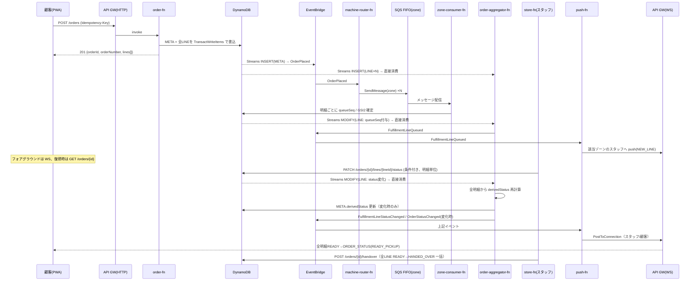

# アーキテクチャ設計書 — カフェ向けモバイルオーダーアプリ

**バージョン**: 2.0
**作成日**: 2026-07-02
**最終更新**: 2026-07-12（複数ゾーン注文を明細（FulfillmentLine）単位モデルへ全面改訂。DynamoDBキー設計〔§6〕を新設、`order-aggregator-fn`を追加、store-fn/status-fnのAPI契約とEventBridgeスキーマを改訂。[Issue #11](https://github.com/Masaharu1223/AWS_OrderSystem/issues/11) の決定を反映）
**関連文書**: `requirements.md`（要件定義書 v1.2）
**対象読者**: 実装担当（中級者想定）

本書は Lambda 関数のインターフェース設計と DynamoDB キー設計を中心に、AWS サーバーレス構成の全体像を定義する。要件は `requirements.md` を正とし、本書はその実装契約（入出力の型・データモデル）を規定する。

---

## 0. v2.0 改訂の背骨

1回の会計（注文）に含まれる商品（明細＝FulfillmentLine）は、商品ごとに異なるゾーンへ振り分けられる（requirements.md §7.2）。v1.0 は状態（`zone`/`queueSeq`/`status`）を注文レコード1件にしか持たせられず、複数ゾーンにまたがる注文で致命的な不整合が起きることが判明した（[Issue #6](https://github.com/Masaharu1223/AWS_OrderSystem/issues/6)、[Issue #11](https://github.com/Masaharu1223/AWS_OrderSystem/issues/11) で決定）。v2.0 は以下の3原則でこれを解消する。

1. **明細（LINE）が唯一の書き込み対象。注文ステータスは導出値。** スタッフ・システムは LINE の `status` だけを書き換える。注文ステータス（`derivedStatus`）は全明細から計算される読み取り専用の値であり、直接の書き込み対象にしない（requirements.md §6.2）。
2. **導出とイベント発火は DynamoDB Streams を直接消費する単一の集約関数（`order-aggregator-fn`）に集める。** 1注文の全アイテム（META + 全LINE）は同一 `orderId` を PK に持つため、Streams は同一注文の変更を順序保証つきで配信する。これにより「全ゾーン完成の瞬間（`READY_PICKUP`）」の判定・通知が二重発火しないことを基盤レベルで保証する。EventBridge は順序保証のいらないファンアウト通知にのみ使う。
3. **キュー順序はゾーン別に採番する `queueSeq` で一意に決める。** SQS FIFO（`MessageGroupId=zone`）で直列化された受付順を、ゾーン別カウンタの原子的インクリメントで明細ごとの `queueSeq` に落とす。

---

## 1. 全体アーキテクチャ



---

## 2. Lambda 一覧（確定構成）

| # | 関数名 | トリガー | 認証 | 役割 |
|---|---|---|---|---|
| 1 | `menu-fn` | HTTP API | なし | メニュー一覧・商品詳細 |
| 2 | `cart-fn` | HTTP API | なし | カート CRUD |
| 3 | `order-fn` | HTTP API | なし | 注文確定（全明細を一括作成）・キャンセル |
| 4 | `status-fn` | HTTP API | なし | ステータスポーリング・キュー位置（明細単位で算出） |
| 5 | `store-fn` | HTTP API | Cognito | ゾーン別明細一覧・明細ステータス更新・注文一括受渡 |
| 6 | `connect-fn` | WebSocket `$connect` | なし | connectionId 保存 |
| 7 | `disconnect-fn` | WebSocket `$disconnect` | なし | connectionId 削除 |
| 8 | `push-fn` | EventBridge（主）/ `$default`（スタブ） | — | クライアントへ WebSocket push |
| 9 | `machine-router-fn` | EventBridge（`OrderPlaced`） | — | 明細ごとにゾーンの SQS FIFO へ振り分け |
| 10 | `zone-consumer-fn` | SQS FIFO ×4 | — | 明細ごとの受付順（`queueSeq`）確定 |
| 11 | `order-aggregator-fn` | **DynamoDB Streams（直接）** | — | 明細から注文導出ステータスを再計算、ゾーン別EMA更新、イベント発火 |
| (将来) | `payment-fn` | HTTP API | — | 決済 Webhook（雛形のみ） |

---

## 3. インターフェースはトリガーで4種類に分かれる

Lambda の「インターフェース」の外殻は、受け取る AWS イベント型で決まる。混在させず 4 分類で設計する。

| 種別 | 関数 | Go ハンドラ型（aws-lambda-go） |
|---|---|---|
| **HTTP API** | menu / cart / order / status / store | `events.APIGatewayV2HTTPRequest` → `events.APIGatewayV2HTTPResponse` |
| **WebSocket API** | connect / disconnect / push(`$default`) | `events.APIGatewayWebsocketProxyRequest` → `events.APIGatewayProxyResponse` |
| **内部イベント（EventBridge）** | machine-router / push | `events.EventBridgeEvent`（detail をカスタム型でパース） |
| **内部イベント（SQS）** | zone-consumer | `events.SQSEvent` |
| **内部イベント（DynamoDB Streams 直接）** | order-aggregator | `events.DynamoDBEvent` |

`order-aggregator-fn` だけは EventBridge を経由せず Streams を直接消費する（§0 原則2）。同一注文の全アイテムが同一パーティションキーに属するため、Streams のシャード内順序保証を導出ロジックの直列化に利用するのが目的であり、他の内部イベントと役割が異なる。

---

## 4. 設計原則：アダプタ層 / ドメイン層の分離

各 Lambda は「AWS イベントに依存する外殻」と「非依存のドメインロジック」を分離する。ドメイン層が本質的なインターフェースであり、単体テスト対象となる。

```go
// ① 外殻アダプタ（AWS 依存。薄く保つ）
func main() { lambda.Start(route) }

func route(ctx context.Context, req events.APIGatewayV2HTTPRequest) (events.APIGatewayV2HTTPResponse, error) {
    switch req.RouteKey { // 例: "POST /cart/{sessionId}/items"
    case "GET /cart/{sessionId}":
        return adaptJSON(cart.Get)(ctx, req)
    case "POST /cart/{sessionId}/items":
        return adaptJSON(cart.AddItem)(ctx, req)
    // ...
    default:
        return notFound(), nil
    }
}

// ② ドメイン層（AWS 非依存。ここが「インターフェース」の本体）
func AddItem(ctx context.Context, in AddItemInput) (Cart, error)
```

- **1 関数 = 1 ドメイン**。cart-fn は 4 ルートを内部の RouteKey ディスパッチで処理する（過分割を避ける）。
- `adaptJSON` はボディの JSON デコード・パスパラメータ抽出・レスポンスの JSON エンコード・エラー→HTTP 変換を共通化するヘルパ。

---

## 5. 共通契約

### 5.1 エラーエンベロープ（全 HTTP Lambda 共通）

```json
{ "error": { "code": "VALIDATION_ERROR", "message": "quantity exceeds maximum (10)", "requestId": "..." } }
```

| code | HTTP | 用途 |
|---|---|---|
| `VALIDATION_ERROR` | 400 | enum 違反・個数上限・必須欠落 |
| `UNAUTHORIZED` | 401 | Cognito JWT 無効（Staff API） |
| `NOT_FOUND` | 404 | 商品・注文が存在しない |
| `CONFLICT` | 409 | 状態遷移違反・冪等キー衝突・楽観ロック失敗 |
| `TOO_MANY_REQUESTS` | 429 | スロットリング |
| `INTERNAL` | 500 | 想定外エラー |

### 5.2 共通の値オブジェクト

```json
// variant（温度 + サイズ）。itemId = "{productId}#{temperature}#{size}"
{ "temperature": "hot | iced", "size": "S | M | L" }
```

---

## 6. DynamoDB テーブル設計

単一テーブル `MobileOrderTable` を維持する。requirements.md §11.3 のアクセスパターン表（AP1〜AP8、AP-Z1〜Z4）に対応する物理設計を以下に定める。

### 6.1 アイテム種別

| 種別 | PK | SK | 主な属性 |
|---|---|---|---|
| 注文ヘッダ（META） | `ORDER#<orderId>` | `META` | orderNumber, storeId, derivedStatus, totalPrice, lineCount, createdAt, updatedAt, GSI1PK, GSI1SK |
| 明細（LINE） | `ORDER#<orderId>` | `LINE#<lineId>` | productId, name, category, variant, quantity, unitPrice, zone, status, queueSeq, preparedAt, readyAt, createdAt, updatedAt, GSI2PK, GSI2SK |
| ゾーン採番カウンタ | `ZONESEQ#<storeId>#<zone>` | `COUNTER` | seq（Number） |
| ゾーン統計（EMA） | `ZONESTAT#<storeId>#<zone>` | `EMA` | emaSeconds, sampleCount, updatedAt |
| 冪等キー | `IDEMPOTENCY#<key>` | `META` | orderId, TTL |
| 接続（別テーブル） | `connectionId`（ConnectionTable） | `orderId` / `ZONE#<zone>` | TTL 2h（§8参照） |

**明細の粒度**: 1 LINE = カート1行（`productId` + `variant`）とし、`quantity` を LINE に保持する（同一商品を1個ずつ複数明細に分割しない）。ゾーンは `category + size` から一意に決まり `quantity` に依存しないため、1 LINE は必ず1ゾーンに写像される。スワイプ操作（requirements.md §5.3）も LINE 単位で1回。

`lineId` は注文内でカート順に採番したゼロ埋め連番（`001`, `002`, …）。安定・一意で、SQS の `MessageDeduplicationId`（`<orderId>#<lineId>`）にも流用する。

### 6.2 GSI1（店舗：導出ステータス別の注文一覧）

```
GSI1PK = STORE#<storeId>#<derivedStatus>
GSI1SK = <createdAt>
```

META にのみ付与。指す `status` は**注文の導出ステータス**（requirements.md §6.2）。用途: 受渡担当の注文一覧（AP7）。例: `STORE#store-01#READY_PICKUP` を Query して一括受渡対象のカードを取得。維持は `order-aggregator-fn`（導出時）・`order-fn`（キャンセル時）・`store-fn`（一括受渡時）が行う。

### 6.3 GSI2（ゾーン別製造キュー。スパースインデックス）

```
GSI2PK = ZONE#<storeId>#<zone>
GSI2SK = <queueSeq>   ← Number型
```

**メンバーシップ規則**: `GSI2PK`/`GSI2SK` を持つのは明細の `status` が `WAITING` または `PREPARING` の間だけ。`READY`/`CANCELLED`/`HANDED_OVER` へ遷移する書き込みで `GSI2PK`/`GSI2SK` を **REMOVE** し、インデックスから外す。これにより GSI2 は「そのゾーンでまだキューに並んでいる明細」だけを `queueSeq` 昇順で保持する。

用途:
- **AP-Z1（ゾーン別明細一覧）**: `Query GSI2PK=ZONE#store-01#B, ScanIndexForward=true`
- **AP-Z2（キュー位置）**: `Query GSI2PK=ZONE#store-01#B, queueSeq < :myseq, Select=COUNT` → `position = count + 1`

**採番タイミング**: `order-fn` の作成時点では `status=WAITING`、`queueSeq` なし（GSI2に未投入）。`zone-consumer-fn` がゾーン別カウンタを原子的インクリメントして `queueSeq` を確定し、同じ更新で `GSI2PK`/`GSI2SK` を書き込む（§9.4）。この空白（通常サブ秒）の間、スタッフへの新規カード表示は WebSocket の `FulfillmentLineQueued`（§9.6）で埋める。

**採番の冪等性**: `zone-consumer-fn` の更新は `ConditionExpression: attribute_not_exists(queueSeq)` を付ける。SQS の at-least-once 再配信で同一明細を二度処理しても二重採番しない。

### 6.4 具体例（requirements.md §6.4 のラテL+紅茶M）

```
# 注文ヘッダ
PK=ORDER#ord-xyz  SK=META
  derivedStatus=STORE_ACCEPTED  orderNumber=42  storeId=store-01
  lineCount=2  totalPrice=1280  createdAt=2026-07-12T12:00:00Z
  GSI1PK=STORE#store-01#STORE_ACCEPTED  GSI1SK=2026-07-12T12:00:00Z

# 明細1（ラテL → Zone A）※zone-consumer-fn 処理後
PK=ORDER#ord-xyz  SK=LINE#001
  productId=prod-001  name=カフェラテ  category=espresso
  variant={temperature:hot,size:L}  quantity=1  unitPrice=560
  zone=A  status=WAITING  queueSeq=1542
  GSI2PK=ZONE#store-01#A  GSI2SK=1542

# 明細2（紅茶M → Zone D）
PK=ORDER#ord-xyz  SK=LINE#002
  productId=prod-014  name=紅茶  category=tea
  variant={temperature:hot,size:M}  quantity=1  unitPrice=420
  zone=D  status=WAITING  queueSeq=880
  GSI2PK=ZONE#store-01#D  GSI2SK=880
```

GSI は **GSI1 + GSI2 の2本**（v1.0 は GSI1 のみ）。

---

## 7. HTTP Lambda 契約

### 7.1 menu-fn

```
GET /menu               → 200 MenuResponse
GET /menu/{productId}   → 200 Product | 404
```

```json
// Product
{ "productId": "prod-001", "category": "espresso", "name": "カフェラテ",
  "basePrice": 450, "sizeDelta": { "S": 0, "M": 50, "L": 100 },
  "allowHot": true, "allowIced": true, "available": true }

// MenuResponse
{ "categories": [ { "category": "espresso", "products": [ /* Product */ ] } ] }
```

> `GET /menu/{productId}` は全メニューを取得し該当商品を返す（category 不要）。

### 7.2 cart-fn

```
GET    /cart/{sessionId}                 → 200 Cart
POST   /cart/{sessionId}/items           → 201 Cart      body: AddItemInput
PUT    /cart/{sessionId}/items/{itemId}  → 200 Cart      body: { "quantity": 3 }
DELETE /cart/{sessionId}/items/{itemId}  → 204
```

```json
// AddItemInput（unitPrice/lineTotal はサーバーが算出。クライアント値は無視）
{ "productId": "prod-001", "category": "espresso",
  "variant": { "temperature": "iced", "size": "M" }, "quantity": 2 }

// Cart
{ "sessionId": "sess-abc",
  "items": [ { "itemId": "prod-001#iced#M", "productId": "prod-001", "name": "カフェラテ",
    "variant": { "temperature": "iced", "size": "M" },
    "quantity": 2, "unitPrice": 500, "lineTotal": 1000 } ],
  "subtotal": 1000 }
```

### 7.3 order-fn

```
POST  /orders                   → 201 Order   header: Idempotency-Key   body: { "sessionId": "...", "storeId": "..." }
PATCH /orders/{orderId}/cancel  → 200 Order | 409（全明細 WAITING 以外）
```

```json
// Order（各明細に lineId/zone/status を含む）
{ "orderId": "ord-xyz", "orderNumber": 42, "storeId": "store-01",
  "status": "STORE_ACCEPTED", "totalPrice": 1280,
  "lines": [
    { "lineId": "001", "productId": "prod-001", "name": "カフェラテ",
      "variant": { "temperature": "hot", "size": "L" }, "quantity": 1,
      "unitPrice": 560, "zone": "A", "status": "WAITING" },
    { "lineId": "002", "productId": "prod-014", "name": "紅茶",
      "variant": { "temperature": "hot", "size": "M" }, "quantity": 1,
      "unitPrice": 420, "zone": "D", "status": "WAITING" }
  ],
  "createdAt": "2026-07-12T12:00:00Z" }
```

**POST /orders**: サーバー側カート（sessionId）から全明細を生成し、DynamoDB `TransactWriteItems` で1トランザクションとして書き込む。

- `Put IDEMPOTENCY#<key>`（`ConditionExpression: attribute_not_exists(PK)` で二重注文防止）
- `Put ORDER#<orderId> / META`（`derivedStatus=STORE_ACCEPTED`、GSI1付与）
- `Put ORDER#<orderId> / LINE#<lineId>` × N（各明細。`category+size` からゾーンをここで判定し `zone` を確定、`status=WAITING`。`queueSeq`/GSI2 は zone-consumer-fn が後で付与）

`ConditionalCheckFailed`（冪等キー衝突）時は既存注文を読んで同じ `Order` を返す。

- **order-fn は SQS も EventBridge も直接呼ばない**。DynamoDB へ全明細を書くのみ。後続は Streams → EventBridge（machine-router 向け）／Streams → order-aggregator-fn（導出・通知向け）が駆動する。

**PATCH /orders/{orderId}/cancel**（requirements.md §4.5「全明細が `WAITING` の間のみ」）: `TransactWriteItems` で、各 LINE を `status: WAITING→CANCELLED`（`ConditionExpression: status = WAITING`、GSI2キーをREMOVE）＋ META を `derivedStatus→CANCELLED`（GSI1PK更新）。1明細でも `WAITING` でなければトランザクション全体が失敗し `409`。これにより「全明細WAITINGかどうか」を原子的に強制する。

### 7.4 status-fn

```
GET /orders/{orderId}                 → 200 OrderStatus
GET /orders/{orderId}/queue-position  → 200 QueuePosition
```

```json
// OrderStatus（status は READ 時に全明細から §6.2 のルールで導出。META.derivedStatus に依存しないため常に最新）
{ "orderId": "ord-xyz", "orderNumber": 42, "status": "PREPARING", "updatedAt": "2026-07-12T12:05:00Z",
  "lines": [
    { "lineId": "001", "name": "カフェラテ", "zone": "A", "status": "READY", "quantity": 1 },
    { "lineId": "002", "name": "紅茶", "zone": "D", "status": "PREPARING", "quantity": 1 }
  ] }

// QueuePosition（明細ごとの配列。注文全体の待ちは最遅ゾーンに律速される）
{ "orderId": "ord-xyz", "orderStatus": "PREPARING",
  "lines": [
    { "lineId": "001", "zone": "A", "status": "PREPARING", "position": null, "estimatedWaitMinutes": 1 },
    { "lineId": "002", "zone": "D", "status": "WAITING", "position": 4, "estimatedWaitMinutes": 8 }
  ],
  "estimatedReadyMinutes": 8 }
```

- 各明細の `position` は担当ゾーンの GSI2 を AP-Z2 で COUNT して算出。`READY`/`HANDED_OVER`/`CANCELLED` の明細は `position: null`。
- `estimatedWaitMinutes` はゾーン別 EMA（`ZONESTAT.emaSeconds`）× `position` を分換算。
- **`estimatedReadyMinutes` = 全アクティブ明細の `estimatedWaitMinutes` の最大値**。`READY_PICKUP` は「最も遅いゾーンが完成した瞬間」（requirements.md §6.2）なので、注文全体の待ち時間は最遅明細に律速される。

### 7.5 store-fn（Cognito 認証）

v1.0 の `PATCH /orders/{orderId}/status`（注文単位）は**廃止**し、明細単位の操作と注文単位の一括受渡に分割する。

```
GET   /stores/{storeId}/zones/{zone}/lines?status=WAITING   → 200 { "lines": [ LineCard ] }
PATCH /orders/{orderId}/lines/{lineId}/status                → 200 Line | 409   body: { "fromStatus": "WAITING", "toStatus": "PREPARING" }
GET   /stores/{storeId}/orders?status=READY_PICKUP           → 200 { "orders": [ OrderCard ] }
POST  /orders/{orderId}/handover                             → 200 Order | 409
```

- 認証は `req.RequestContext.Authorizer.JWT.Claims` から取得。

**GET /stores/{storeId}/zones/{zone}/lines**（GSI2 を Query。requirements.md §5.2 のゾーン別一覧）:

```json
{ "lines": [
  { "orderId": "ord-xyz", "orderNumber": 42, "lineId": "001", "zone": "A",
    "productId": "prod-001", "name": "カフェラテ",
    "variant": { "temperature": "hot", "size": "L" }, "quantity": 1,
    "status": "WAITING", "queueSeq": 1542, "createdAt": "2026-07-12T12:00:00Z" }
] }
```

**PATCH /orders/{orderId}/lines/{lineId}/status**（requirements.md §5.4 アンドゥ確定時の唯一の書き込み点）:

- 許可遷移は **`WAITING→PREPARING` と `PREPARING→READY` のみ**（`HANDED_OVER` は一括受渡でのみ、`CANCELLED` はキャンセルAPIでのみ）。それ以外は 409。
- `ConditionExpression: status = :fromStatus`。二重スワイプ・複数タブレット間の競合を 409 で弾く。
- `PREPARING` 遷移で `preparedAt` を記録（GSI2は維持）。`READY` 遷移で `readyAt` を記録し **GSI2キーをREMOVE**（製造キューから離脱）。

```json
// response 200
{ "orderId": "ord-xyz", "lineId": "001", "zone": "A", "status": "PREPARING",
  "preparedAt": "2026-07-12T12:02:00Z" }
```

**POST /orders/{orderId}/handover**（requirements.md §6.3 一括受渡。リクエストボディ不要）:

- `TransactWriteItems` で、META を `ConditionExpression: derivedStatus = READY_PICKUP` の上で `derivedStatus→HANDED_OVER`（GSI1PK更新）、各非キャンセルLINEを `status: READY→HANDED_OVER`（`ConditionExpression: status = READY`）に更新。
- 1明細でも `READY` でない、または注文が `READY_PICKUP` でなければ全体失敗し 409。「一部だけ渡して残りを渡し忘れる」事故を構造的に排除する。

---

## 8. WebSocket Lambda 契約

```go
func handle(ctx context.Context, req events.APIGatewayWebsocketProxyRequest) (events.APIGatewayProxyResponse, error)
```

| 関数 | ルート | 入力 | 動作 |
|---|---|---|---|
| connect-fn | `$connect` | クエリ `?orderId=`（顧客）/ `?zone=`（スタッフ）+ `connectionId` | ConnectionTable に保存（TTL 2h） |
| disconnect-fn | `$disconnect` | `connectionId` | ConnectionTable から削除 |
| push-fn(`$default`) | `$default` | クライアント送信メッセージ | 当面スタブ（将来のクライアント→サーバー通信用） |

`ConnectionTable`: PK=`connectionId`, SK=`orderId`（顧客）/ `ZONE#<zone>`（スタッフ）, TTL=2h。変更なし。

### 8.1 WebSocket ペイロード（push-fn → クライアント、`type` で区別）

```json
{ "type": "ORDER_STATUS", "orderId": "ord-xyz", "status": "READY_PICKUP" }              // 顧客向け
{ "type": "LINE_STATUS",  "orderId": "ord-xyz", "lineId": "002", "status": "READY" }    // スタッフ向け（顧客へは任意）
{ "type": "NEW_LINE",     "zone": "A", "orderId": "ord-xyz", "lineId": "001", "queueSeq": 1542 } // スタッフ向け
```

---

## 9. 内部イベント Lambda 契約

非同期系の「インターフェース」＝ **EventBridge の detail スキーマ**。ここを固定すれば書き込み側と消費側が疎結合になる。順序保証が必要な導出処理（§0原則2）は EventBridge を経由せず DynamoDB Streams を直接消費する。

### 9.1 OrderPlaced（Streams INSERT、META起点）

```json
// detail-type: "OrderPlaced"
{ "orderId": "ord-xyz", "storeId": "store-01", "orderNumber": 42,
  "lines": [
    { "lineId": "001", "productId": "prod-001", "category": "espresso", "size": "L", "zone": "A", "quantity": 1 },
    { "lineId": "002", "productId": "prod-014", "category": "tea", "size": "M", "zone": "D", "quantity": 1 }
  ] }
```

`zone` は order-fn が作成時点で既に確定済みの値をそのまま含む（§7.3）。

### 9.2 FulfillmentLineStatusChanged（新設。明細単位の状態変化）

`order-aggregator-fn` が LINE の MODIFY（`status` 変化）で発火。

```json
// detail-type: "FulfillmentLineStatusChanged"
{ "orderId": "ord-xyz", "storeId": "store-01", "lineId": "001", "zone": "A",
  "oldStatus": "WAITING", "newStatus": "PREPARING", "changedAt": "2026-07-12T12:02:00Z" }
```

### 9.3 FulfillmentLineQueued（新設。新規カードのスタッフ通知）

`order-aggregator-fn` が LINE の MODIFY のうち「`queueSeq` が新規に確定した」変化を検出して発火。

```json
// detail-type: "FulfillmentLineQueued"
{ "orderId": "ord-xyz", "storeId": "store-01", "lineId": "001", "zone": "A",
  "orderNumber": 42, "queueSeq": 1542 }
```

### 9.4 OrderStatusChanged（改訂。zoneを持たない注文導出ステータスの変化）

v1.0 は「注文単位 old/newStatus（単一zone付き）」だったが、複数ゾーン注文では zone を一意に決められない（[Issue #6](https://github.com/Masaharu1223/AWS_OrderSystem/issues/6)）。v2.0 では **zone を持たない注文導出ステータスの変化**に改める。`order-aggregator-fn` が `derivedStatus` 変化時のみ発火する。

```json
// detail-type: "OrderStatusChanged"
{ "orderId": "ord-xyz", "storeId": "store-01",
  "oldStatus": "PREPARING", "newStatus": "READY_PICKUP", "changedAt": "2026-07-12T12:07:00Z" }
```

`newStatus=READY_PICKUP` が「受取可能」通知そのものであり、専用の別イベントは作らない。Streams のシャード内順序保証と「`derivedStatus`変化時のみ発火」の組み合わせにより、1注文につき厳密に1回だけ発火する（§0原則2）。

### 9.5 machine-router-fn

- 入力: `OrderPlaced`。
- 処理: 各明細の `zone`（order-fn が確定済み）に対応する SQS FIFO へ `SendMessage`（`MessageGroupId = zone`、`MessageDeduplicationId = <orderId>#<lineId>`）。
- 出力: なし。

### 9.6 push-fn

- 入力: `FulfillmentLineStatusChanged` / `FulfillmentLineQueued` / `OrderStatusChanged`。
- 処理:
  - `FulfillmentLineStatusChanged`・`FulfillmentLineQueued` → ConnectionTable の `ZONE#<zone>` を引き、該当ゾーンのスタッフへ push（§8.1 `LINE_STATUS`/`NEW_LINE`）。
  - `OrderStatusChanged` → ConnectionTable の `orderId` を引き、顧客へ push（§8.1 `ORDER_STATUS`）。
- 出力: なし（送信失敗＝切断済みは ConnectionTable から掃除）。
- v1.0 からの変更点: 入力イベントが3種に増え、送信先の判定にゾーン/顧客の取り違えが起きない（`FulfillmentLineStatusChanged`は必ず正しい`zone`を持つため）。

### 9.7 zone-consumer-fn（SQS FIFO ×4）

```go
func handle(ctx context.Context, ev events.SQSEvent) error
```

- 入力: 各ゾーン FIFO のメッセージ（`{ orderId, lineId, zone }`）。
- 処理:
  1. 対象 LINE（`PK=ORDER#<orderId>, SK=LINE#<lineId>`）を読み、`status=CANCELLED` ならスキップ（requirements.md §7.3）。既に `queueSeq` が設定済みならスキップ（冪等）。
  2. `ZONESEQ#<storeId>#<zone>` を `ADD seq :one` で原子的にインクリメントし `newSeq` を得る（§6.1 AP-Z3）。
  3. **LINE を更新**（v1.0からの変更点: 注文レコードではなく明細レコードへ書く）: `SET zone=:zone, queueSeq=:newSeq, GSI2PK=ZONE#<storeId>#<zone>, GSI2SK=:newSeq`、`ConditionExpression: attribute_not_exists(queueSeq)`。
- FIFO 保証: `MessageGroupId = zone` によりゾーン内で `queueSeq` が受付順に単調増加する。

### 9.8 order-aggregator-fn（新設）

```go
func handle(ctx context.Context, ev events.DynamoDBEvent) error
```

| 項目 | 内容 |
|---|---|
| トリガー | DynamoDB Streams を**直接**消費（EventBridge を経由しない）。フィルタ: `SK begins_with LINE#` かつ `eventName ∈ {INSERT, MODIFY}` |
| 責務 | (a) LINE 変更ごとに同一 `orderId` の全明細を Query し、requirements.md §6.2 のルールで `derivedStatus` を再計算。変化があった場合のみ META を更新（GSI1PK も更新）。(b) `PREPARING→READY` の明細について `readyAt - preparedAt` を計算し、当該明細の `zone` の `ZONESTAT` へ EMA を反映（ゾーンへの正しい帰属）。(c) §9.2〜9.4 のイベントを発火 |
| 順序保証 | 同一注文の全アイテムは同一パーティションキー（`ORDER#<orderId>`）に属するため、Streams は単一シャードへ順序配信する。導出処理はこの順序で直列実行され、`OrderStatusChanged(READY_PICKUP)` は1注文につき厳密に1回だけ発火する |
| ループ防止 | 自身が書き込む META の変更は `SK begins_with LINE#` フィルタで無視する |

**なぜこの関数を新設するか**: `store-fn`（明細PATCH）に導出・EMA更新・通知を直接持たせる案（インライン方式）も検討したが、2ゾーンがほぼ同時に `READY` になると読み取り→META更新が競合し、`READY_PICKUP`を二重計算する恐れがある。楽観ロック＋リトライで防げなくはないが、書き込みパスに通知・EMAが密結合しスワイプAPIのレイテンシも悪化する。Streams集約方式は `store-fn` を「1明細の条件付き更新」だけの単純な関数に保てる。代償は「META.derivedStatus がサブ秒だけ遅延する」ことだが、`status-fn`（§7.4）は READ 時に明細から導出するため顧客ポーリングは常に最新の値を返す。GSI1（受渡一覧）とイベント発火のみが `order-aggregator-fn` が材料化した META を参照する。

---

## 10. 注文フロー全体（シーケンス）



---

## 11. インターフェース設計チェックリスト

- [ ] 全 HTTP エンドポイントが RouteKey ディスパッチで 5 関数に収まる
- [ ] ドメイン層関数が AWS 型に非依存（単体テスト可能）
- [ ] エラーは共通エンベロープに統一
- [ ] order-fn は同期書き込みのみ（非同期は Streams→EventBridge / Streams→order-aggregator に委譲）
- [ ] EventBridge detail スキーマ（OrderPlaced / FulfillmentLineStatusChanged / FulfillmentLineQueued / OrderStatusChanged）が固定
- [ ] zone-consumer-fn が CANCELLED をスキップし、`queueSeq`採番が冪等（requirements.md §7.3 準拠）
- [ ] store-fn の明細PATCHが条件付き書き込みで遷移を検証（`fromStatus`一致のみ許可）
- [ ] store-fn の一括受渡が「全明細READY＋注文READY_PICKUP」を条件付きトランザクションで検証
- [ ] 注文ステータス（`derivedStatus`）への直接書き込みが存在しない（常に明細からの導出、またはorder-aggregator-fnのみが更新）
- [ ] GSI2が「WAITING/PREPARING の明細のみ」を保持するスパースインデックスとして維持されている（READY以降でキーをREMOVE）
- [ ] order-aggregator-fnがDynamoDB Streamsを直接消費し、EventBridgeを経由していない
