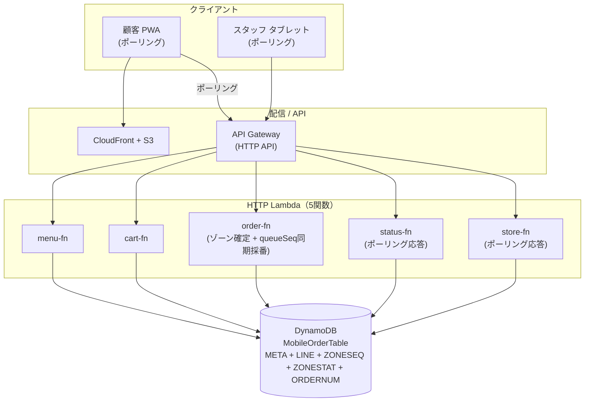
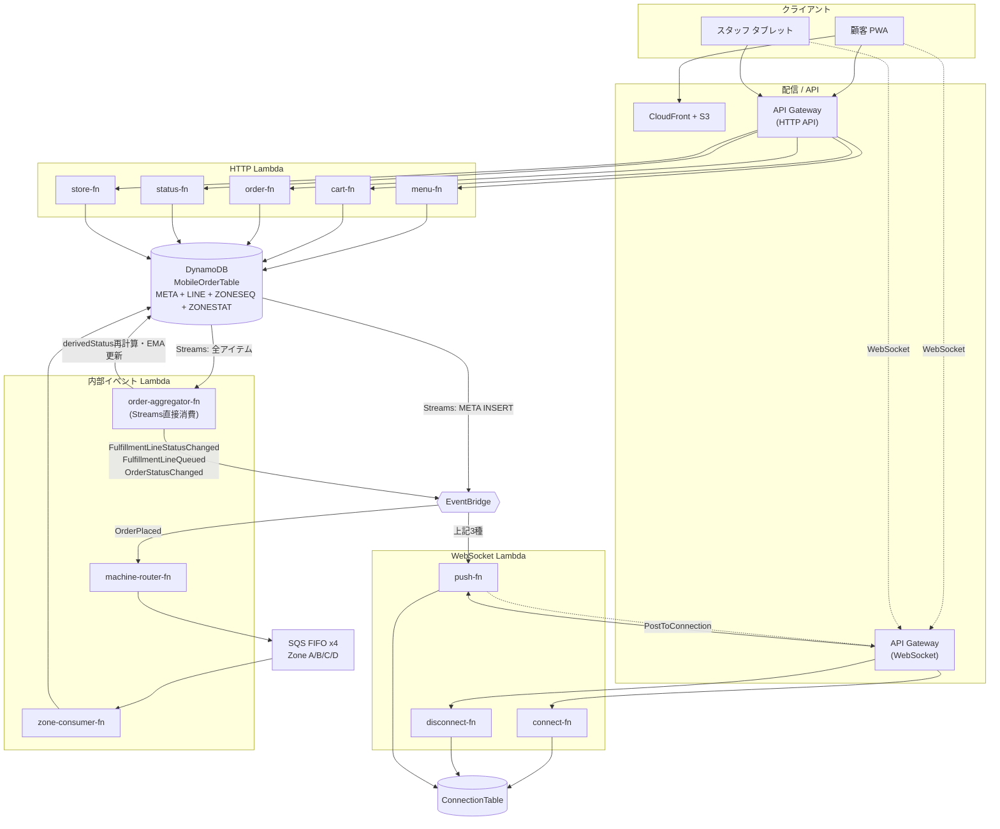
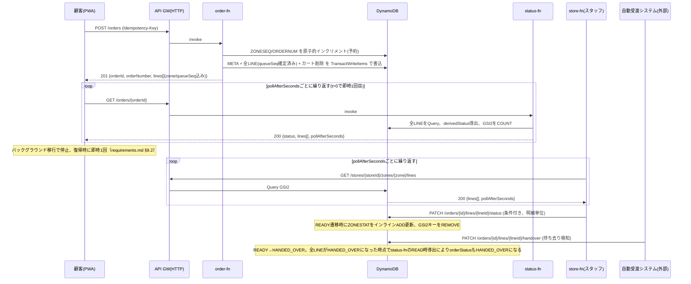
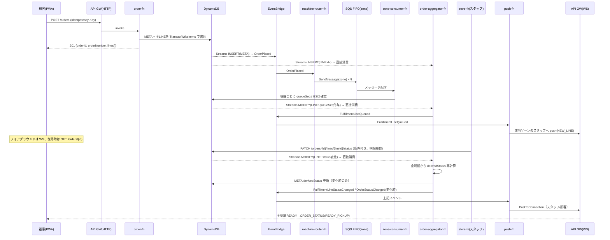

# アーキテクチャ設計書 — カフェ向けモバイルオーダーアプリ

**バージョン**: 2.3
**作成日**: 2026-07-02
**最終更新**: 2026-08-07（顧客向けフロント実装の前提整備として、`DELETE /cart/{sessionId}/items/{itemId}`の応答契約を`204`から`200 Cart`に変更。`POST`/`PUT`と同様に更新後のカート全体を返すことで、クライアント側が削除後に再GETする必要をなくし、3種のミューテーションAPI全てで契約を統一した〔§7.2〕）
**2026-08-01更新**: スライス②cart-fnの詳細設計を反映。§6.1にカート明細アイテムの行を追加し、DynamoDBのTTL属性名を`expiresAt`に確定。§7.2に数量上限・空カート応答・品切れ商品拒否等の運用ルールを明記〔§6.1, §7.2〕
**2026-07-31更新**: [Issue #7](https://github.com/Masaharu1223/AWS_OrderSystem/issues/7)・[Issue #8](https://github.com/Masaharu1223/AWS_OrderSystem/issues/8) の決定を反映しMVP範囲を再定義。`queueSeq`採番をSQS FIFO経由から`order-fn`内のDynamoDB原子カウンタ同期採番へ変更、リアルタイム通知をWebSocketからHTTPポーリング〔`pollAfterSeconds`〕へ変更。`machine-router-fn`/`zone-consumer-fn`/SQS FIFO×4/`order-aggregator-fn`/WebSocket一式をMVPスコープ外の「将来」章へ格下げ。`POST /orders/{orderId}/handover`（旧設計の名残、自動受渡システム仕様と矛盾していた）を削除し`PATCH /orders/{orderId}/lines/{lineId}/handover`に置換〔§0, §1, §2, §3, §6.1, §6.3, §7.3, §7.4, §7.5, §8, §9, §10, §11〕
**関連文書**: `requirements.md`（要件定義書 v1.8）
**対象読者**: 実装担当（中級者想定）

本書は Lambda 関数のインターフェース設計と DynamoDB キー設計を中心に、AWS サーバーレス構成の全体像を定義する。要件は `requirements.md` を正とし、本書はその実装契約（入出力の型・データモデル）を規定する。

---

## 0. v2.0 改訂の背骨（v2.1でMVP範囲を再定義）

1回の会計（注文）に含まれる商品（明細＝FulfillmentLine）は、商品ごとに異なるゾーンへ振り分けられる（requirements.md §7.2）。v1.0 は状態（`zone`/`queueSeq`/`status`）を注文レコード1件にしか持たせられず、複数ゾーンにまたがる注文で致命的な不整合が起きることが判明した（[Issue #6](https://github.com/Masaharu1223/AWS_OrderSystem/issues/6)、[Issue #11](https://github.com/Masaharu1223/AWS_OrderSystem/issues/11) で決定）。v2.0 は以下の3原則でこれを解消した。

1. **明細（LINE）が唯一の書き込み対象。注文ステータスは導出値。** スタッフ・システムは LINE の `status` だけを書き換える。注文ステータス（`derivedStatus`）は全明細から計算される読み取り専用の値であり、直接の書き込み対象にしない（requirements.md §6.2）。**この原則はv2.1でも変更なし。**
2. **（v2.0時点、将来の再導入候補）導出とイベント発火は DynamoDB Streams を直接消費する単一の集約関数（`order-aggregator-fn`）に集める。** 1注文の全アイテム（META + 全LINE）は同一 `orderId` を PK に持つため、Streams は同一注文の変更を順序保証つきで配信する。これにより「全ゾーン完成の瞬間（`READY_PICKUP`）」の判定・通知が二重発火しないことを基盤レベルで保証する。**v2.1のMVPでは`order-aggregator-fn`を導入せず、`status-fn`がREAD時に全明細から`derivedStatus`を直接導出する**（§7.4）ため、この集約関数自体が不要になっている。GSI1の消費者（売上集計等）が必要になった時点で再導入を検討する（§12）。
3. **（v2.1で変更）キュー順序はゾーン別に採番する `queueSeq` で一意に決める。** v2.0では SQS FIFO（`MessageGroupId=zone`）で直列化された受付順をゾーン別カウンタで`queueSeq`に落としていたが、[Issue #7](https://github.com/Masaharu1223/AWS_OrderSystem/issues/7) の指摘（SQS到着順と注文発生順がズレうる）を受け、**v2.1では`order-fn`がゾーン別カウンタ（`ZONESEQ#<storeId>#<zone>`）を注文確定処理内で直接`UpdateItem(ADD)`する同期方式**に変更した。直列化点はこの原子的インクリメントただ1つであり、SQSという別の直列化点と衝突する余地がない。途中失敗による欠番は許容し、`queueSeq`はキュー位置算出（`Query ... COUNT`、§6.3 AP-Z2）にのみ用いる。

**v2.1（2026-07-31、MVP範囲の再定義）**: 上記の変更に伴い、`machine-router-fn`・`zone-consumer-fn`・SQS FIFO×4・`order-aggregator-fn`・WebSocket一式（`connect-fn`/`disconnect-fn`/`push-fn`/`ConnectionTable`）はいずれもMVPスコープ外とした（requirements.md §14.12, §14.13）。本書はこれらを削除せず「将来」章として残す（§8, §9）。MVPのLambda構成は`menu-fn`/`cart-fn`/`order-fn`/`status-fn`/`store-fn`の5関数のみ（§2）。

---

## 1. 全体アーキテクチャ

### 1.1 MVP版（現行、v2.1）


```mermaid
flowchart TB
    subgraph client["クライアント"]
        C["顧客 PWA<br/>(ポーリング)"]
        S["スタッフ タブレット<br/>(ポーリング)"]
    end

    subgraph edge["配信 / API"]
        CF["CloudFront + S3"]
        HTTP["API Gateway<br/>(HTTP API)"]
    end

    subgraph httpfn["HTTP Lambda（5関数）"]
        MENU["menu-fn"]
        CART["cart-fn"]
        ORDER["order-fn<br/>(ゾーン確定 + queueSeq同期採番)"]
        STATUS["status-fn<br/>(ポーリング応答)"]
        STORE["store-fn<br/>(ポーリング応答)"]
    end

    DDB[("DynamoDB<br/>MobileOrderTable<br/>META + LINE + ZONESEQ + ZONESTAT + ORDERNUM")]

    C --> CF
    C -->|ポーリング| HTTP
    S --> HTTP

    HTTP --> MENU & CART & ORDER & STATUS & STORE
    MENU & CART & ORDER & STATUS & STORE --> DDB
```

非同期パイプライン（EventBridge・SQS・`order-aggregator-fn`）とWebSocket一式は存在しない。`order-fn`がゾーン確定と`queueSeq`採番を同期的に行い、`status-fn`/`store-fn`はDynamoDBをREADしてポーリング応答を返すのみ（requirements.md §14.12, §14.13）。

### 1.2 将来版（WebSocket・非同期製造キュー再導入時）


```mermaid
flowchart TB
    subgraph client["クライアント"]
        C["顧客 PWA"]
        S["スタッフ タブレット"]
    end

    subgraph edge["配信 / API"]
        CF["CloudFront + S3"]
        HTTP["API Gateway<br/>(HTTP API)"]
        WS["API Gateway<br/>(WebSocket)"]
    end

    subgraph httpfn["HTTP Lambda"]
        MENU["menu-fn"]
        CART["cart-fn"]
        ORDER["order-fn"]
        STATUS["status-fn"]
        STORE["store-fn"]
    end

    subgraph wsfn["WebSocket Lambda"]
        CONN["connect-fn"]
        DISC["disconnect-fn"]
        PUSH["push-fn"]
    end

    subgraph internal["内部イベント Lambda"]
        AGG["order-aggregator-fn<br/>(Streams直接消費)"]
        ROUTER["machine-router-fn"]
        CONSUMER["zone-consumer-fn"]
    end

    DDB[("DynamoDB<br/>MobileOrderTable<br/>META + LINE + ZONESEQ + ZONESTAT")]
    CONNDB[("ConnectionTable")]
    EB{{"EventBridge"}}
    Q["SQS FIFO x4<br/>Zone A/B/C/D"]

    C --> CF
    C --> HTTP
    C -.->|WebSocket| WS
    S --> HTTP
    S -.->|WebSocket| WS

    HTTP --> MENU & CART & ORDER & STATUS & STORE
    MENU & CART & ORDER & STATUS & STORE --> DDB
    WS --> CONN & DISC & PUSH
    CONN & DISC --> CONNDB

    DDB -->|Streams: META INSERT| EB
    DDB -->|Streams: 全アイテム| AGG
    EB -->|OrderPlaced| ROUTER
    ROUTER --> Q
    Q --> CONSUMER
    CONSUMER --> DDB
    AGG -->|derivedStatus再計算・EMA更新| DDB
    AGG -->|FulfillmentLineStatusChanged<br/>FulfillmentLineQueued<br/>OrderStatusChanged| EB
    EB -->|上記3種| PUSH
    PUSH --> CONNDB
    PUSH -.->|PostToConnection| WS
```

> 将来版は§8・§9で詳細を維持している。**注意**: 将来版のSQS/zone-consumer-fnによる`queueSeq`採番は旧設計であり、v2.1で`order-fn`同期採番に置き換わった（§0原則3）。再導入する場合は「確定済みの`queueSeq`をStreams経由でSQSへ流す」形に設計し直す必要がある（requirements.md §14.12）。

---

## 2. Lambda 一覧（MVP: 5関数、v2.1）

| # | 関数名 | トリガー | 認証 | 役割 |
|---|---|---|---|---|
| 1 | `menu-fn` | HTTP API | なし | メニュー一覧・商品詳細 |
| 2 | `cart-fn` | HTTP API | なし | カート CRUD |
| 3 | `order-fn` | HTTP API | なし | 注文確定（ゾーン確定・`queueSeq`同期採番・全明細を一括作成）・キャンセル |
| 4 | `status-fn` | HTTP API | なし | 注文状態・キュー位置のポーリング応答（READ時に明細から導出） |
| 5 | `store-fn` | HTTP API | Cognito | ゾーン別明細一覧（ポーリング応答）・明細ステータス更新・ZONESTAT更新 |
| (将来) | `payment-fn` | HTTP API | — | 決済 Webhook（雛形のみ） |

### 2.1 将来のLambda（MVPスコープ外、requirements.md §12・§14.12・§14.13）

| # | 関数名 | トリガー | 役割 | 再導入する条件 |
|---|---|---|---|---|
| 6 | `connect-fn` | WebSocket `$connect` | connectionId 保存 | ポーリングのコスト・体感速度が問題になった時点 |
| 7 | `disconnect-fn` | WebSocket `$disconnect` | connectionId 削除 | 同上 |
| 8 | `push-fn` | EventBridge（主）/ `$default`（スタブ） | クライアントへ WebSocket push | 同上 |
| 9 | `machine-router-fn` | EventBridge（`OrderPlaced`） | 明細ごとにゾーンの SQS FIFO へ振り分け | 自動製造マシン連携が現実化した時点 |
| 10 | `zone-consumer-fn` | SQS FIFO ×4 | 明細ごとの受付順（`queueSeq`）確定 | 同上（v2.1では`order-fn`が同期採番するため不要） |
| 11 | `order-aggregator-fn` | DynamoDB Streams（直接） | 明細から注文導出ステータスを再計算、GSI1更新、イベント発火 | GSI1の消費者（売上集計・注文一覧画面等）が必要になった時点 |

これらの詳細契約は削除せず§8・§9に「将来」として残す。

---

## 3. インターフェース種別（MVPはHTTP APIのみ）

Lambda の「インターフェース」の外殻は、受け取る AWS イベント型で決まる。**MVPでは全5関数がHTTP APIのみ**を受け取る。

| 種別 | 関数 | Python ハンドラ型（aws-lambda-powertools） |
|---|---|---|
| **HTTP API** | menu / cart / order / status / store | `APIGatewayProxyEventV2` → `dict`（`statusCode`/`body`） |

### 3.1 将来のインターフェース種別（§2.1の関数群、MVPスコープ外）

| 種別 | 関数 | Python ハンドラ型（aws-lambda-powertools） |
|---|---|---|
| **WebSocket API** | connect / disconnect / push(`$default`) | 生の `dict`（`requestContext.routeKey` で分岐）→ `dict`（`statusCode`必須） |
| **内部イベント（EventBridge）** | machine-router / push | `EventBridgeEvent`（`detail` をPydanticモデル等でパース） |
| **内部イベント（SQS）** | zone-consumer | `SQSEvent` |
| **内部イベント（DynamoDB Streams 直接）** | order-aggregator | `DynamoDBStreamEvent` |

`order-aggregator-fn`（再導入時）だけは EventBridge を経由せず Streams を直接消費する設計とする（§0 原則2）。同一注文の全アイテムが同一パーティションキーに属するため、Streams のシャード内順序保証を導出ロジックの直列化に利用するのが目的であり、他の内部イベントと役割が異なる。

---

## 4. 設計原則：アダプタ層 / ドメイン層の分離

各 Lambda は「AWS イベントに依存する外殻」と「非依存のドメインロジック」を分離する。ドメイン層が本質的なインターフェースであり、単体テスト対象となる。

```python
# ① 外殻アダプタ（AWS 依存。薄く保つ）
from aws_lambda_powertools.utilities.data_classes import APIGatewayProxyEventV2

def handler(event: dict, context) -> dict:
    return route(APIGatewayProxyEventV2(event))

def route(req: APIGatewayProxyEventV2) -> dict:
    match req.route_key:  # 例: "POST /cart/{sessionId}/items"
        case "GET /cart/{sessionId}":
            return adapt_json(cart.get)(req)
        case "POST /cart/{sessionId}/items":
            return adapt_json(cart.add_item)(req)
        # ...
        case _:
            return not_found()

# ② ドメイン層（AWS 非依存。ここが「インターフェース」の本体）
def add_item(in_: AddItemInput) -> Cart: ...
```

- **1 関数 = 1 ドメイン**。cart-fn は 4 ルートを内部の RouteKey ディスパッチで処理する（過分割を避ける）。
- `adapt_json` はボディの JSON デコード・パスパラメータ抽出・レスポンスの JSON エンコード・エラー→HTTP 変換を共通化するヘルパ。

---

## 5. 共通契約

### 5.1 エラーエンベロープ（全 HTTP Lambda 共通）

```json
{ "error": { "code": "VALIDATION_ERROR", "message": "quantity exceeds maximum (10)", "requestId": "..." } }
```

| code | HTTP | 用途 |
|---|---|---|
| `VALIDATION_ERROR` | 400 | enum 違反・個数上限・必須欠落 |
| `UNAUTHORIZED` | 401 | Cognito JWT 無効（Staff API） |
| `NOT_FOUND` | 404 | 商品・注文が存在しない |
| `CONFLICT` | 409 | 状態遷移違反・冪等キー衝突・楽観ロック失敗 |
| `TOO_MANY_REQUESTS` | 429 | スロットリング |
| `INTERNAL` | 500 | 想定外エラー |

### 5.2 共通の値オブジェクト

```json
// variant（温度 + サイズ）。itemId = "{productId}#{temperature}#{size}"
{ "temperature": "hot | iced", "size": "S | M | L" }
```

---

## 6. DynamoDB テーブル設計

単一テーブル `MobileOrderTable` を維持する。requirements.md §11.3 のアクセスパターン表（AP1〜AP8、AP-Z1〜Z4）に対応する物理設計を以下に定める。

### 6.1 アイテム種別

| 種別 | PK | SK | 主な属性 |
|---|---|---|---|
| 商品（Product） | `MENU`（固定） | `PROD#<productId>` | category, name, basePrice, sizeDelta, allowHot, allowIced, available, displayOrder（任意） |
| カート明細（ITEM、新設v2.2） | `CART#<sessionId>` | `ITEM#<productId>#<temperature>#<size>` | productId, category, name, variant, quantity, unitPrice, addedAt, updatedAt, **expiresAt**（TTL）。`unitPrice`は追加/変更時点でのスナップショット（write-time計算）。`itemId`・`lineTotal`は保存せず、それぞれSKと`quantity×unitPrice`から都度導出する |
| 注文ヘッダ（META） | `ORDER#<orderId>` | `META` | orderNumber, storeId, derivedStatus, totalPrice, lineCount, createdAt, updatedAt, GSI1PK, GSI1SK |
| 明細（LINE） | `ORDER#<orderId>` | `LINE#<lineId>` | productId, name, category, variant, quantity, unitPrice, zone, status, queueSeq, preparedAt, readyAt, createdAt, updatedAt, GSI2PK, GSI2SK。**v2.1: zone/queueSeq/GSI2PK/GSI2SKは`order-fn`の作成トランザクション内で確定済みの値として書き込まれる（§6.3・§7.3）** |
| ゾーン採番カウンタ | `ZONESEQ#<storeId>#<zone>` | `COUNTER` | seq（Number）。永久に単調増加させ、リセットしない |
| 注文番号カウンタ（新設、v2.1） | `ORDERNUM#<storeId>#<yyyy-mm-dd>` | `COUNTER` | seq（Number）。店舗・日付単位。TTL 7日 |
| ゾーン統計（移動平均、v2.1で属性変更） | `ZONESTAT#<storeId>#<zone>` | `STAT` | sumSeconds, sampleCount, updatedAt（旧`emaSeconds`から変更。平均値=`sumSeconds / sampleCount`、`store-fn`が`ADD`でインラインに原子的加算） |
| 冪等キー | `IDEMPOTENCY#<key>` | `META` | orderId, **sessionId**（v2.1で追加。衝突時に照合し他セッションへの注文内容漏洩を防ぐ）, TTL |
| 接続（別テーブル、将来） | `connectionId`（ConnectionTable） | `orderId` / `ZONE#<zone>` | TTL 2h（§8参照、MVPスコープ外） |

**明細の粒度**: 1 LINE = カート1行（`productId` + `variant`）とし、`quantity` を LINE に保持する（同一商品を1個ずつ複数明細に分割しない）。ゾーンは `category + size` から一意に決まり `quantity` に依存しないため、1 LINE は必ず1ゾーンに写像される。スワイプ操作（requirements.md §5.3）も LINE 単位で1回。

**商品（Product）のキー設計**: 商品点数が少ない前提のため、`category` ごとにパーティションを分けず全商品を `PK=MENU`（固定）の単一パーティションに集約する。`GET /menu`（§7.1）は `Query PK=MENU` で全件取得し in-memory で `category` 属性によりグループ化して返す。`GET /menu/{productId}` は `GetItem PK=MENU, SK=PROD#<productId>` で単体取得する（O(1)、category をパスに含めない）。

`lineId` は注文内でカート順に採番したゼロ埋め連番（`001`, `002`, …）。安定・一意で、SQS の `MessageDeduplicationId`（`<orderId>#<lineId>`）にも流用する。

**TTL属性（新設v2.2）**: `MobileOrderTable`のTTLは`expiresAt`（Number、UNIX epoch秒）という単一の属性名をテーブル全体で共有する（DynamoDBのTTLは1テーブルにつき1属性しか設定できないため）。カート明細（ITEM）はv2.2で最初にこの属性を使う（追加/更新のたびに現在時刻+24時間へ再計算し、操作のない放置カートを自動的に消す）。将来`order-fn`を実装する際、`IDEMPOTENCY`アイテムや`ORDERNUM#`カウンタのTTLも同じ`expiresAt`属性名に載せる。DynamoDBのTTLによる実際の削除は最大48時間程度遅延しうるため、期限直後の数時間はカートがまだ読み出せる可能性がある（MVPでは実害なしとして許容し、アプリ側でのフィルタは行わない）。

### 6.2 GSI1（店舗：導出ステータス別の注文一覧）

```
GSI1PK = STORE#<storeId>#<derivedStatus>
GSI1SK = <createdAt>
```

META にのみ付与。指す `status` は**注文の導出ステータス**（requirements.md §6.2）。**v2.1: MVPでは能動的な読み手が無い**（§7.5、自動受渡システム導入によりスタッフの受渡待ち一覧確認自体が不要になったため）。維持は`order-fn`（作成時・キャンセル時）のみが行い、`PREPARING`/`READY_PICKUP`/`HANDED_OVER`への追随更新は行わない。将来`order-aggregator-fn`を再導入し、売上集計等の消費者が現れた際に追随更新を再開する想定（requirements.md §14.12）。

### 6.3 GSI2（ゾーン別製造キュー。スパースインデックス）

```
GSI2PK = ZONE#<storeId>#<zone>
GSI2SK = <queueSeq>   ← Number型
```

**メンバーシップ規則**: `GSI2PK`/`GSI2SK` を持つのは明細の `status` が `WAITING` または `PREPARING` の間だけ。`READY`/`CANCELLED`/`HANDED_OVER` へ遷移する書き込みで `GSI2PK`/`GSI2SK` を **REMOVE** し、インデックスから外す。これにより GSI2 は「そのゾーンでまだキューに並んでいる明細」だけを `queueSeq` 昇順で保持する。

用途:
- **AP-Z1（ゾーン別明細一覧）**: `Query GSI2PK=ZONE#store-01#B, ScanIndexForward=true`
- **AP-Z2（キュー位置）**: `Query GSI2PK=ZONE#store-01#B, queueSeq < :myseq, Select=COUNT` → `position = count + 1`

**採番タイミング（v2.1）**: `order-fn` が注文確定処理の中で `queueSeq` を**同期的に**確定し、`GSI2PK`/`GSI2SK` も含めた完成形のLINEアイテムを`TransactWriteItems`で書き込む（§7.3）。旧設計（`zone-consumer-fn`が後から非同期に確定）にあった「GSI2未投入の空白期間」は存在しない。`POST /orders`のレスポンスが返った時点で、該当明細は既にGSI2上でスタッフから見える状態になっている。

**採番手順**: ゾーンごとに1回、`UpdateItem(PK=ZONESEQ#<storeId>#<zone>, ADD seq :n, ReturnValues=UPDATED_NEW)`でカウンタをブロック予約する（`n`=そのゾーンの明細数）。戻り値`v`から`[v-n+1, v]`の連番ブロックを取得し、`lineId`昇順に割り当てる。1注文が複数ゾーンにまたがる場合もゾーン数ぶん（最大4回）の呼び出しで済む。

**採番の冪等性と欠番許容**: 冪等性は`zone-consumer-fn`時代のような条件式（`attribute_not_exists(queueSeq)`）ではなく、**トランザクションの原子性そのものが担保する**。カウンタ予約後にトランザクション本体（`TransactWriteItems`）が失敗した場合、予約済みの番号は使われないまま「欠番」になるが、これは実害がないため許容する（`queueSeq`は順序とキュー位置カウント〔AP-Z2〕にのみ使う値のため）。この欠番許容の原則により、失敗時の補償処理・整合性修復バッチが一切不要になる（requirements.md §14.12）。冪等キー（`Idempotency-Key`）による通常の再送は、カウンタ予約前の事前チェック（`GetItem PK=IDEMPOTENCY#<key>`）で弾かれるため、カウンタに触れることすらない（§7.3）。

### 6.4 具体例（requirements.md §6.4 のラテL+紅茶M）

```
# 注文ヘッダ
PK=ORDER#ord-xyz  SK=META
  derivedStatus=STORE_ACCEPTED  orderNumber=42  storeId=store-01
  lineCount=2  totalPrice=1280  createdAt=2026-07-12T12:00:00Z
  GSI1PK=STORE#store-01#STORE_ACCEPTED  GSI1SK=2026-07-12T12:00:00Z

# 明細1（ラテL → Zone A）※order-fn の作成トランザクション内でqueueSeqまで確定済み（v2.1）
PK=ORDER#ord-xyz  SK=LINE#001
  productId=prod-001  name=カフェラテ  category=espresso
  variant={temperature:hot,size:L}  quantity=1  unitPrice=560
  zone=A  status=WAITING  queueSeq=1542
  GSI2PK=ZONE#store-01#A  GSI2SK=1542

# 明細2（紅茶M → Zone D）
PK=ORDER#ord-xyz  SK=LINE#002
  productId=prod-014  name=紅茶  category=tea
  variant={temperature:hot,size:M}  quantity=1  unitPrice=420
  zone=D  status=WAITING  queueSeq=880
  GSI2PK=ZONE#store-01#D  GSI2SK=880
```

GSI は **GSI1 + GSI2 の2本**（v1.0 は GSI1 のみ）。

---

## 7. HTTP Lambda 契約

### 7.1 menu-fn

```
GET /menu               → 200 MenuResponse
GET /menu/{productId}   → 200 Product | 404
```

```json
// Product
{ "productId": "prod-001", "category": "espresso", "name": "カフェラテ",
  "basePrice": 450, "sizeDelta": { "S": 0, "M": 50, "L": 100 },
  "allowHot": true, "allowIced": true, "available": true }

// MenuResponse
{ "categories": [ { "category": "espresso", "products": [ /* Product */ ] } ] }
```

> `GET /menu/{productId}` は全メニューを取得し該当商品を返す（category 不要）。

### 7.2 cart-fn

```
GET    /cart/{sessionId}                 → 200 Cart
POST   /cart/{sessionId}/items           → 201 Cart      body: AddItemInput
PUT    /cart/{sessionId}/items/{itemId}  → 200 Cart      body: { "quantity": 3 }
DELETE /cart/{sessionId}/items/{itemId}  → 200 Cart
```

```json
// AddItemInput（unitPrice/lineTotal はサーバーが算出。クライアント値は無視）
{ "productId": "prod-001", "category": "espresso",
  "variant": { "temperature": "iced", "size": "M" }, "quantity": 2 }

// Cart
{ "sessionId": "sess-abc",
  "items": [ { "itemId": "prod-001#iced#M", "productId": "prod-001", "name": "カフェラテ",
    "variant": { "temperature": "iced", "size": "M" },
    "quantity": 2, "unitPrice": 500, "lineTotal": 1000 } ],
  "subtotal": 1000 }
```

**運用ルール（新設v2.2）**:

| 項目 | 仕様 |
|---|---|
| 数量上限 | `quantity`は1〜10（`AddItemInput`/PUTボディ双方に適用。超過は`400 VALIDATION_ERROR`）。カート全体の合計数量には上限を設けない |
| 空カートへのGET | `CART#<sessionId>`配下に行が1件も無くても`404`にはせず、`200`＋`{"items":[],"subtotal":0}`を返す（`sessionId`はクライアント生成のUUIDのため、サーバー側に「存在するセッション」という概念がない） |
| `quantity<=0`のPUT | `400 VALIDATION_ERROR`。個数を0にする操作は許可せず、削除は`DELETE`を使う（暗黙削除は行わない） |
| 品切れ商品(`available:false`)の追加 | `400 VALIDATION_ERROR`で拒否する。ただし追加後に品切れになったケースは`GET`では検知しない（`unitPrice`と同じくwrite-timeスナップショット方式のため）。この場合の最終防御は`order-fn`の確定時再検証に委ねる（§7.3） |
| バリデーション対象の`variant` | 許可される温度（`allowHot`/`allowIced`）・サイズ（`sizeDelta`のキー集合）は、商品マスタ（`Product`、§7.1）の定義をそのまま参照する。カート側で別ルールを持たない |
| TTL | カート明細は`expiresAt`（§6.1）により追加/更新のたびに現在時刻+24時間へ延長される。放置されたカートは最終操作から24時間程度で自動的に消える |

### 7.3 order-fn

```
POST  /orders                   → 201 Order   header: Idempotency-Key   body: { "sessionId": "...", "storeId": "..." }
PATCH /orders/{orderId}/cancel  → 200 Order | 409（全明細 WAITING 以外）
```

```json
// Order（各明細に lineId/zone/status/queueSeq を含む。v2.1でqueueSeqを追加）
{ "orderId": "ord-xyz", "orderNumber": 42, "storeId": "store-01",
  "status": "STORE_ACCEPTED", "totalPrice": 1280,
  "lines": [
    { "lineId": "001", "productId": "prod-001", "name": "カフェラテ",
      "variant": { "temperature": "hot", "size": "L" }, "quantity": 1,
      "unitPrice": 560, "zone": "A", "status": "WAITING", "queueSeq": 1542 },
    { "lineId": "002", "productId": "prod-014", "name": "紅茶",
      "variant": { "temperature": "hot", "size": "M" }, "quantity": 1,
      "unitPrice": 420, "zone": "D", "status": "WAITING", "queueSeq": 880 }
  ],
  "createdAt": "2026-07-12T12:00:00Z" }
```

**POST /orders（v2.1: queueSeq同期採番を統合）**: サーバー側カート（sessionId）から全明細を生成し、ゾーン別カウンタを予約したうえでDynamoDB `TransactWriteItems` により1トランザクションとして書き込む。「カウンタ予約が先、注文書き込みが後」の順序にすることで、原子性・冪等性・失敗時の後始末を同時に解く（requirements.md §14.12）。

| # | ステップ | 操作 | 失敗時 |
|---|---|---|---|
| 0 | 冪等キー事前チェック | `GetItem PK=IDEMPOTENCY#<key>, SK=META`（強整合読み） | ヒットしたら`sessionId`を照合し、一致すれば既存注文を返して終了（カウンタ未消費）。不一致なら`409 CONFLICT`（他セッションの注文内容漏洩防止） |
| 1 | 検証・明細生成 | カート読み込み、価格再計算、`category+size` → `zone` 確定、明細数上限（20件）チェック | 上限超過は`400 VALIDATION_ERROR`。カウンタ未消費 |
| 2 | ゾーン別カウンタ予約 | ゾーンごとに1回 `UpdateItem(PK=ZONESEQ#<storeId>#<zone>, ADD seq :n, ReturnValues=UPDATED_NEW)`（`n`=そのゾーンの明細数）。戻り値`v`から`[v-n+1, v]`のブロックを`lineId`昇順に割当。1注文が複数ゾーンにまたがっても呼び出しはゾーン数ぶん（最大4回） | 500。予約済みの番号は欠番になるだけ（実害なし、§6.3） |
| 3 | 注文番号予約 | `UpdateItem(PK=ORDERNUM#<storeId>#<yyyy-mm-dd>, ADD seq :1, ReturnValues=UPDATED_NEW)` | 同上 |
| 4 | 全書き込み | 1回の`TransactWriteItems`：`Put IDEMPOTENCY#<key>`（`ConditionExpression: attribute_not_exists(PK)`、`ReturnValuesOnConditionCheckFailure=ALL_OLD`）／`Put META`（`derivedStatus=STORE_ACCEPTED`、GSI1付与）／`Put LINE#<lineId>`×N（`zone`/`queueSeq`/`GSI2PK`/`GSI2SK`を確定値で含む完成形）／`Delete CART#<sessionId>/ITEM#...`×N（カート明細） | `TransactionCanceled(ConditionalCheckFailed)`→冪等キー衝突。返却された`ALL_OLD`から`orderId`を取得し、追加の`GetItem`なしで既存注文を返す |
| 5 | 応答 | `201`。各LINEに`zone`/`queueSeq`/`status=WAITING`を含めて返す | — |

- **カート明細の削除を同一トランザクションに含める**。別処理にすると「注文成立＋カート残存」で顧客が重複再注文しうる（新しい冪等キーになるため冪等チェックでは防げない）
- `TransactWriteItems`は最大100アクション。`1(idem) + 1(META) + N(LINE) + N(カート削除) = 2 + 2N`のため、明細数上限20件で42アクションに収まる
- 途中の書き込み失敗（ステップ2〜3で予約した番号がステップ4で使われない）による欠番は許容する。`queueSeq`・注文番号は順序と件数カウントにのみ使う値であり、補償処理・整合性修復バッチは不要（§6.3）
- **order-fn は SQS も EventBridge も呼ばない**。後続の非同期処理は存在しない（v2.1、requirements.md §14.12）

**PATCH /orders/{orderId}/cancel**（requirements.md §4.5「全明細が `WAITING` の間のみ」）: `TransactWriteItems` で、各 LINE を `status: WAITING→CANCELLED`（`ConditionExpression: status = WAITING`、GSI2キーをREMOVE）＋ META を `derivedStatus→CANCELLED`（GSI1PK更新）。1明細でも `WAITING` でなければトランザクション全体が失敗し `409`。これにより「全明細WAITINGかどうか」を原子的に強制する。

### 7.4 status-fn（v2.1: ポーリング契約として正式化）

```
GET /orders/{orderId}                 → 200 OrderStatus（ポーリング対象。requirements.md §9）
GET /orders/{orderId}/queue-position  → 200 QueuePosition（同一情報の射影。WebSocket移行後の「位置だけ」用途として契約を維持）
```

```json
// OrderStatus（status は READ 時に全明細から §6.2 のルールで導出。META.derivedStatus に依存しないため常に最新。
// v2.1でキュー位置・待ち時間・pollAfterSecondsを統合し、これ1本のポーリングで完結させる）
{ "orderId": "ord-xyz", "orderNumber": 42, "status": "PREPARING", "updatedAt": "2026-07-12T12:05:00Z",
  "lines": [
    { "lineId": "001", "name": "カフェラテ", "zone": "A", "status": "READY", "quantity": 1, "position": null, "estimatedWaitMinutes": 0 },
    { "lineId": "002", "name": "紅茶", "zone": "D", "status": "PREPARING", "quantity": 1, "position": 1, "estimatedWaitMinutes": 1 }
  ],
  "estimatedReadyMinutes": 1,
  "pollAfterSeconds": 5 }

// QueuePosition（queue-position単体エンドポイント。OrderStatusのlines配列と同じ算出ロジックの部分集合）
{ "orderId": "ord-xyz", "orderStatus": "PREPARING",
  "lines": [
    { "lineId": "001", "zone": "A", "status": "READY", "position": null, "estimatedWaitMinutes": 0 },
    { "lineId": "002", "zone": "D", "status": "PREPARING", "position": 1, "estimatedWaitMinutes": 1 }
  ],
  "estimatedReadyMinutes": 1,
  "pollAfterSeconds": 5 }
```

- 各明細の `position` は担当ゾーンの GSI2 を AP-Z2 で COUNT して算出。`READY`/`HANDED_OVER`/`CANCELLED` の明細は `position: null`。**`WAITING`だけでなく`PREPARING`の明細も算出対象**（スタッフはゾーン内の明細をqueueSeq順に処理するとは限らず、自分より前に未完成の明細が残っていればカウントに含まれるため。旧版でPREPARING明細を一律`null`としていたのは本文の規則と矛盾する誤りだったため訂正）
- `estimatedWaitMinutes` はゾーン別の製造時間移動平均（`ZONESTAT.sumSeconds / sampleCount`、requirements.md §8.2）× `position` を分換算
- **`estimatedReadyMinutes` = 全アクティブ明細の `estimatedWaitMinutes` の最大値**。`READY_PICKUP` は「最も遅いゾーンが完成した瞬間」（requirements.md §6.2）なので、注文全体の待ち時間は最遅明細に律速される
- **`pollAfterSeconds`**: クライアントが次回ポーリングまで待機すべき秒数。目安は「全明細`WAITING`かつ最大position≥5なら15秒」「position≤4またはいずれかが`PREPARING`なら5秒」「`READY_PICKUP`なら10秒」「`HANDED_OVER`/`CANCELLED`なら`null`（ポーリング終了の合図）」（requirements.md §9.1）
- **最適化**: 全明細が`READY`/`HANDED_OVER`/`CANCELLED`（非アクティブ）の場合、GSI2へのCOUNTクエリを丸ごとスキップし`position`は算出せず`null`を返す（受取待ちフェーズの読み取りコストをゼロにする）

### 7.5 store-fn（Cognito 認証。受渡検知エンドポイントのみ別認証、v2.1で契約矛盾を解消）

v1.0 の `PATCH /orders/{orderId}/status`（注文単位）は廃止し、明細単位の操作に分割する。**v2.1で`POST /orders/{orderId}/handover`（スタッフによる手動一括受渡確認、旧設計の名残）を削除**し、requirements.md §5.5・§6.3・§7.4が定める自動受渡システム（電子パネル＋検知カメラ）仕様に合わせて、外部システムからの検知通知を受ける明細単位のエンドポイントに置き換える。この矛盾は`tasks/todo.md` §2で積み残しとして記録されていたもので、本改訂で解消する。

```
GET   /stores/{storeId}/zones/{zone}/lines?status=WAITING     → 200 { "lines": [ LineCard ], "pollAfterSeconds": 3 }（ポーリング対象、§9）
PATCH /orders/{orderId}/lines/{lineId}/status                  → 200 Line | 409   body: { "fromStatus": "WAITING", "toStatus": "PREPARING" }
PATCH /orders/{orderId}/lines/{lineId}/handover                → 200 Line | 409（外部システム専用。Cognitoではなく別認証、下記参照）
```

- Staff向け2エンドポイント（一覧・ステータス更新）の認証は `req.RequestContext.Authorizer.JWT.Claims` から取得（Cognito）
- **`GET /stores/{storeId}/orders?status=READY_PICKUP`（受渡待ち一覧、旧AP7の利用箇所）は廃止**。自動受渡システム導入によりスタッフが「受渡待ち注文」を見て手動確認する運用自体が無くなったため、この一覧のMVPでの用途が消滅した（§6.2のGSI1定義自体は維持するが、MVPでは`order-fn`の作成時・キャンセル時のみ書き込まれ、`PREPARING`/`READY_PICKUP`/`HANDED_OVER`への追随更新は行わない。§0原則2・requirements.md §14.12の通り、これらの状態追随は`order-aggregator-fn`が将来担う想定）
- **`PATCH .../handover`のみ別認証**: 呼び出し元は人間のスタッフではなく既存の自動受渡システム（電子パネル＋検知カメラ）であり、Cognitoログインセッションを持たない。API Gatewayの**APIキー**（`x-api-key`ヘッダ）による認証とし、店舗ごとに1つ払い出す運用を暫定案とする（実機連携時の認証方式は外部システムの仕様に依存するため、導入時に確定させる）

**GET /stores/{storeId}/zones/{zone}/lines**（GSI2 を Query。requirements.md §5.2 のゾーン別一覧）:

```json
{ "lines": [
  { "orderId": "ord-xyz", "orderNumber": 42, "lineId": "001", "zone": "A",
    "productId": "prod-001", "name": "カフェラテ",
    "variant": { "temperature": "hot", "size": "L" }, "quantity": 1,
    "status": "WAITING", "queueSeq": 1542, "createdAt": "2026-07-12T12:00:00Z" }
  ],
  "pollAfterSeconds": 3 }
```

`pollAfterSeconds`はキューに明細がある間3秒、空の間10秒をサーバーが指示する（requirements.md §9.1）。

**PATCH /orders/{orderId}/lines/{lineId}/status**（requirements.md §5.4 アンドゥ確定時の唯一の書き込み点）:

- 許可遷移は **`WAITING→PREPARING` と `PREPARING→READY` のみ**（`HANDED_OVER` は下記の受渡検知エンドポイントでのみ、`CANCELLED` はキャンセルAPIでのみ）。それ以外は 409。
- `ConditionExpression: status = :fromStatus`。二重スワイプ・複数タブレット間の競合を 409 で弾く。
- `PREPARING` 遷移で `preparedAt` を記録（GSI2は維持）。`READY` 遷移で `readyAt` を記録し **GSI2キーをREMOVE**（製造キューから離脱）。同じ更新で`ZONESTAT`（`sumSeconds`/`sampleCount`）を`ADD`でインラインに原子的加算する（`readyAt - preparedAt`を反映、requirements.md §8.2）。

```json
// response 200
{ "orderId": "ord-xyz", "lineId": "001", "zone": "A", "status": "PREPARING",
  "preparedAt": "2026-07-12T12:02:00Z" }
```

**PATCH /orders/{orderId}/lines/{lineId}/handover**（新設。requirements.md §6.3・§7.4の自動受渡システムからの検知通知を受ける。リクエストボディ不要）:

- 自動受渡システムが持ち去りを検知した際に、当該明細の`lineId`を指定して呼び出す
- `ConditionExpression: status = READY`の条件付き更新で`status: READY→HANDED_OVER`（`handedOverAt`を記録）。`READY`以外なら409（二重通知・誤検知への防御）
- 注文全体の受渡完了は、`status-fn`のREAD時導出ルール（requirements.md §6.2: 全明細〔`CANCELLED`除く〕が`HANDED_OVER`）がそのまま適用されるため、META側への追加書き込みは発生しない

---

## 8. WebSocket Lambda 契約（将来、MVPスコープ外）

> **v2.1でMVPスコープ外**（requirements.md §14.13）。ポーリングのコスト・体感速度が問題になった時点で再導入する。契約は削除せず維持し、`status-fn`のレスポンス形（§7.4）をそのまま`push-fn`のペイロードに転用できる設計としている。

```python
def handler(event: dict, context) -> dict:
    route_key = event["requestContext"]["routeKey"]  # "$connect" / "$disconnect" / "$default"
    ...
```

| 関数 | ルート | 入力 | 動作 |
|---|---|---|---|
| connect-fn | `$connect` | クエリ `?orderId=`（顧客）/ `?zone=`（スタッフ）+ `connectionId` | ConnectionTable に保存（TTL 2h） |
| disconnect-fn | `$disconnect` | `connectionId` | ConnectionTable から削除 |
| push-fn(`$default`) | `$default` | クライアント送信メッセージ | 当面スタブ（将来のクライアント→サーバー通信用） |

`ConnectionTable`: PK=`connectionId`, SK=`orderId`（顧客）/ `ZONE#<zone>`（スタッフ）, TTL=2h。変更なし。

### 8.1 WebSocket ペイロード（push-fn → クライアント、`type` で区別）

```json
{ "type": "ORDER_STATUS", "orderId": "ord-xyz", "status": "READY_PICKUP" }              // 顧客向け
{ "type": "LINE_STATUS",  "orderId": "ord-xyz", "lineId": "002", "status": "READY" }    // スタッフ向け（顧客へは任意）
{ "type": "NEW_LINE",     "zone": "A", "orderId": "ord-xyz", "lineId": "001", "queueSeq": 1542 } // スタッフ向け
```

---

## 9. 内部イベント Lambda 契約（将来、MVPスコープ外）

> **v2.1でMVPスコープ外**（requirements.md §14.12・§14.13）。`queueSeq`採番は`order-fn`の同期処理に統合され（§7.3）、状態通知はポーリング（§7.4）に置き換わったため、本節の非同期パイプラインはMVPでは一切使用しない。自動製造マシン連携やGSI1の能動的な消費者（売上集計等）が必要になった時点で再導入を検討する。契約は削除せず将来の再導入に備えて維持する。

非同期系の「インターフェース」＝ **EventBridge の detail スキーマ**。ここを固定すれば書き込み側と消費側が疎結合になる。順序保証が必要な導出処理（§0原則2）は EventBridge を経由せず DynamoDB Streams を直接消費する。

### 9.1 OrderPlaced（Streams INSERT、META起点）

```json
// detail-type: "OrderPlaced"
{ "orderId": "ord-xyz", "storeId": "store-01", "orderNumber": 42,
  "lines": [
    { "lineId": "001", "productId": "prod-001", "category": "espresso", "size": "L", "zone": "A", "quantity": 1 },
    { "lineId": "002", "productId": "prod-014", "category": "tea", "size": "M", "zone": "D", "quantity": 1 }
  ] }
```

`zone` は order-fn が作成時点で既に確定済みの値をそのまま含む（§7.3）。

### 9.2 FulfillmentLineStatusChanged（新設。明細単位の状態変化）

`order-aggregator-fn` が LINE の MODIFY（`status` 変化）で発火。

```json
// detail-type: "FulfillmentLineStatusChanged"
{ "orderId": "ord-xyz", "storeId": "store-01", "lineId": "001", "zone": "A",
  "oldStatus": "WAITING", "newStatus": "PREPARING", "changedAt": "2026-07-12T12:02:00Z" }
```

### 9.3 FulfillmentLineQueued（新設。新規カードのスタッフ通知）

`order-aggregator-fn` が LINE の MODIFY のうち「`queueSeq` が新規に確定した」変化を検出して発火。

```json
// detail-type: "FulfillmentLineQueued"
{ "orderId": "ord-xyz", "storeId": "store-01", "lineId": "001", "zone": "A",
  "orderNumber": 42, "queueSeq": 1542 }
```

### 9.4 OrderStatusChanged（改訂。zoneを持たない注文導出ステータスの変化）

v1.0 は「注文単位 old/newStatus（単一zone付き）」だったが、複数ゾーン注文では zone を一意に決められない（[Issue #6](https://github.com/Masaharu1223/AWS_OrderSystem/issues/6)）。v2.0 では **zone を持たない注文導出ステータスの変化**に改める。`order-aggregator-fn` が `derivedStatus` 変化時のみ発火する。

```json
// detail-type: "OrderStatusChanged"
{ "orderId": "ord-xyz", "storeId": "store-01",
  "oldStatus": "PREPARING", "newStatus": "READY_PICKUP", "changedAt": "2026-07-12T12:07:00Z" }
```

`newStatus=READY_PICKUP` が「受取可能」通知そのものであり、専用の別イベントは作らない。Streams のシャード内順序保証と「`derivedStatus`変化時のみ発火」の組み合わせにより、1注文につき厳密に1回だけ発火する（§0原則2）。

### 9.5 machine-router-fn

- 入力: `OrderPlaced`。
- 処理: 各明細の `zone`（order-fn が確定済み）に対応する SQS FIFO へ `SendMessage`（`MessageGroupId = zone`、`MessageDeduplicationId = <orderId>#<lineId>`）。
- 出力: なし。

### 9.6 push-fn

- 入力: `FulfillmentLineStatusChanged` / `FulfillmentLineQueued` / `OrderStatusChanged`。
- 処理:
  - `FulfillmentLineStatusChanged`・`FulfillmentLineQueued` → ConnectionTable の `ZONE#<zone>` を引き、該当ゾーンのスタッフへ push（§8.1 `LINE_STATUS`/`NEW_LINE`）。
  - `OrderStatusChanged` → ConnectionTable の `orderId` を引き、顧客へ push（§8.1 `ORDER_STATUS`）。
- 出力: なし（送信失敗＝切断済みは ConnectionTable から掃除）。
- v1.0 からの変更点: 入力イベントが3種に増え、送信先の判定にゾーン/顧客の取り違えが起きない（`FulfillmentLineStatusChanged`は必ず正しい`zone`を持つため）。

### 9.7 zone-consumer-fn（SQS FIFO ×4）

```python
from aws_lambda_powertools.utilities.data_classes import SQSEvent
from aws_lambda_powertools.utilities.data_classes.event_source import event_source

@event_source(data_class=SQSEvent)
def handler(event: SQSEvent, context) -> None: ...
```

- 入力: 各ゾーン FIFO のメッセージ（`{ orderId, lineId, zone }`）。
- 処理:
  1. 対象 LINE（`PK=ORDER#<orderId>, SK=LINE#<lineId>`）を読み、`status=CANCELLED` ならスキップ（requirements.md §7.3）。既に `queueSeq` が設定済みならスキップ（冪等）。
  2. `ZONESEQ#<storeId>#<zone>` を `ADD seq :one` で原子的にインクリメントし `newSeq` を得る（§6.1 AP-Z3）。
  3. **LINE を更新**（v1.0からの変更点: 注文レコードではなく明細レコードへ書く）: `SET zone=:zone, queueSeq=:newSeq, GSI2PK=ZONE#<storeId>#<zone>, GSI2SK=:newSeq`、`ConditionExpression: attribute_not_exists(queueSeq)`。
- FIFO 保証: `MessageGroupId = zone` によりゾーン内で `queueSeq` が受付順に単調増加する。

### 9.8 order-aggregator-fn（新設）

```python
from aws_lambda_powertools.utilities.data_classes import DynamoDBStreamEvent
from aws_lambda_powertools.utilities.data_classes.event_source import event_source

@event_source(data_class=DynamoDBStreamEvent)
def handler(event: DynamoDBStreamEvent, context) -> None: ...
```

| 項目 | 内容 |
|---|---|
| トリガー | DynamoDB Streams を**直接**消費（EventBridge を経由しない）。フィルタ: `SK begins_with LINE#` かつ `eventName ∈ {INSERT, MODIFY}` |
| 責務 | (a) LINE 変更ごとに同一 `orderId` の全明細を Query し、requirements.md §6.2 のルールで `derivedStatus` を再計算。変化があった場合のみ META を更新（GSI1PK も更新）。(b) `PREPARING→READY` の明細について `readyAt - preparedAt` を計算し、当該明細の `zone` の `ZONESTAT` へ EMA を反映（ゾーンへの正しい帰属）。(c) §9.2〜9.4 のイベントを発火 |
| 順序保証 | 同一注文の全アイテムは同一パーティションキー（`ORDER#<orderId>`）に属するため、Streams は単一シャードへ順序配信する。導出処理はこの順序で直列実行され、`OrderStatusChanged(READY_PICKUP)` は1注文につき厳密に1回だけ発火する |
| ループ防止 | 自身が書き込む META の変更は `SK begins_with LINE#` フィルタで無視する |

**なぜこの関数を新設するか**: `store-fn`（明細PATCH）に導出・EMA更新・通知を直接持たせる案（インライン方式）も検討したが、2ゾーンがほぼ同時に `READY` になると読み取り→META更新が競合し、`READY_PICKUP`を二重計算する恐れがある。楽観ロック＋リトライで防げなくはないが、書き込みパスに通知・EMAが密結合しスワイプAPIのレイテンシも悪化する。Streams集約方式は `store-fn` を「1明細の条件付き更新」だけの単純な関数に保てる。代償は「META.derivedStatus がサブ秒だけ遅延する」ことだが、`status-fn`（§7.4）は READ 時に明細から導出するため顧客ポーリングは常に最新の値を返す。GSI1（受渡一覧）とイベント発火のみが `order-aggregator-fn` が材料化した META を参照する。

---

## 10. 注文フロー全体（シーケンス）

### 10.1 MVP版（現行、v2.1、ポーリング方式）


```mermaid
sequenceDiagram
    participant C as 顧客(PWA)
    participant H as API GW(HTTP)
    participant O as order-fn
    participant D as DynamoDB
    participant ST as status-fn
    participant S as store-fn(スタッフ)
    participant EXT as 自動受渡システム(外部)

    C->>H: POST /orders (Idempotency-Key)
    H->>O: invoke
    O->>D: ZONESEQ/ORDERNUM を原子的インクリメント(予約)
    O->>D: META + 全LINE(queueSeq確定済み) + カート削除 を TransactWriteItems で書込
    O-->>C: 201 {orderId, orderNumber, lines[](zone/queueSeq込み)}

    loop pollAfterSecondsごとに繰り返す(t=0で即時1回目)
        C->>H: GET /orders/{orderId}
        H->>ST: invoke
        ST->>D: 全LINEをQuery、derivedStatus導出、GSI2をCOUNT
        ST-->>C: 200 {status, lines[], pollAfterSeconds}
    end
    Note over C: バックグラウンド移行で停止、復帰時に即時1回（requirements.md §9.2）

    loop pollAfterSecondsごとに繰り返す
        S->>H: GET /stores/{storeId}/zones/{zone}/lines
        H->>D: Query GSI2
        D-->>S: 200 {lines[], pollAfterSeconds}
    end
    S->>D: PATCH /orders/{id}/lines/{lineId}/status (条件付き、明細単位)
    Note over D: READY遷移時にZONESTATをインラインADD更新、GSI2キーをREMOVE

    EXT->>D: PATCH /orders/{id}/lines/{lineId}/handover (持ち去り検知)
    Note over D: READY→HANDED_OVER。全LINEがHANDED_OVERになった時点でstatus-fnのREAD時導出によりorderStatusもHANDED_OVERになる
```

### 10.2 将来版（WebSocket・非同期製造キュー再導入時）


```mermaid
sequenceDiagram
    participant C as 顧客(PWA)
    participant H as API GW(HTTP)
    participant O as order-fn
    participant D as DynamoDB
    participant EB as EventBridge
    participant R as machine-router-fn
    participant Q as SQS FIFO(zone)
    participant Z as zone-consumer-fn
    participant A as order-aggregator-fn
    participant S as store-fn(スタッフ)
    participant P as push-fn
    participant W as API GW(WS)

    C->>H: POST /orders (Idempotency-Key)
    H->>O: invoke
    O->>D: META + 全LINEを TransactWriteItems で書込
    O-->>C: 201 {orderId, orderNumber, lines[]}
    D-->>EB: Streams INSERT(META) → OrderPlaced
    D-->>A: Streams INSERT(LINE×N) → 直接消費
    EB->>R: OrderPlaced
    R->>Q: SendMessage(zone) ×N
    Q->>Z: メッセージ配信
    Z->>D: 明細ごとに queueSeq / GSI2 確定
    D-->>A: Streams MODIFY(LINE: queueSeq付与) → 直接消費
    A->>EB: FulfillmentLineQueued
    EB->>P: FulfillmentLineQueued
    P->>W: 該当ゾーンのスタッフへ push(NEW_LINE)
    Note over C: フォアグラウンドは WS、復帰時は GET /orders/{id}
    S->>D: PATCH /orders/{id}/lines/{lineId}/status (条件付き、明細単位)
    D-->>A: Streams MODIFY(LINE: status変化) → 直接消費
    A->>A: 全明細から derivedStatus 再計算
    A->>D: META.derivedStatus 更新（変化時のみ）
    A->>EB: FulfillmentLineStatusChanged / OrderStatusChanged(変化時)
    EB->>P: 上記イベント
    P->>W: PostToConnection（スタッフ/顧客）
    W-->>C: 全明細READY→ORDER_STATUS(READY_PICKUP)
```

> 将来版のqueueSeq採番（zone-consumer-fn経由）はv2.1で`order-fn`同期採番に置き換わっている（§0原則3）。再導入時は「確定済みのqueueSeqをStreams経由でSQSへ流す」形に設計し直す必要がある。また受渡確認は将来版でも自動受渡システム経由（`PATCH .../handover`、§7.5）であり、旧v1.0のスタッフ手動一括確認には戻さない。

---

## 11. インターフェース設計チェックリスト

### 11.1 MVP（v2.1）

- [ ] 全 HTTP エンドポイントが RouteKey ディスパッチで 5 関数に収まる
- [ ] ドメイン層関数が AWS 型に非依存（単体テスト可能）
- [ ] エラーは共通エンベロープに統一
- [ ] order-fn は SQS も EventBridge も呼ばず、ゾーン別カウンタ予約→`TransactWriteItems`の同期処理のみで完結している（§7.3）
- [ ] **単一の直列化点**（`ZONESEQ`への`ADD`）のみで受付順を保証しており、SQS到着順など別の直列化点と衝突する余地がない（§0原則3、requirements.md §14.12）
- [ ] **欠番を許容**する設計になっている（採番失敗時の補償処理・整合性修復バッチを実装していない、§6.3）
- [ ] 冪等キー（`Idempotency-Key`）衝突時に`sessionId`を照合し、他セッションの注文内容を返さない
- [ ] store-fn の明細PATCH（`/status`）が条件付き書き込みで遷移を検証（`fromStatus`一致のみ許可）
- [ ] store-fn の受渡検知エンドポイント（`/handover`）が`ConditionExpression: status = READY`で検証し、Cognitoとは別の認証（APIキー等）になっている（§7.5）
- [ ] 注文ステータス（`derivedStatus`）への直接書き込みが存在しない（常に`status-fn`がREAD時に全明細から導出、§6.2）
- [ ] GSI2が「WAITING/PREPARING の明細のみ」を保持するスパースインデックスとして維持されている（READY以降でキーをREMOVE）
- [ ] ポーリングレスポンス（`GET /orders/{orderId}`、`GET /stores/{storeId}/zones/{zone}/lines`）に`pollAfterSeconds`が含まれ、サーバー主導で間隔を制御している（§7.4, §7.5）

### 11.2 将来（再導入時、MVPスコープ外）

- [ ] EventBridge detail スキーマ（OrderPlaced / FulfillmentLineStatusChanged / FulfillmentLineQueued / OrderStatusChanged）が固定
- [ ] zone-consumer-fn が CANCELLED をスキップし、確定済み`queueSeq`をStreams経由でSQSへ流す設計になっている（v2.1の同期採番と矛盾しないよう再設計、§10.2の注記参照）
- [ ] order-aggregator-fnがDynamoDB Streamsを直接消費し、EventBridgeを経由していない
