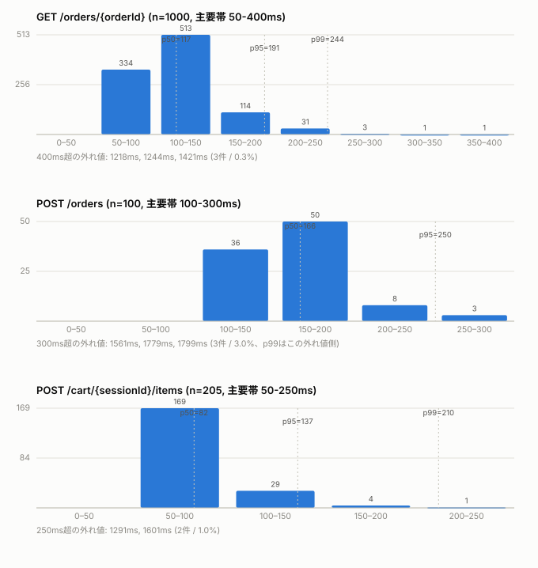

# 想定ピーク負荷の再現テスト結果

## 概要

`docs/requirements.md`が明記する想定負荷(最大同時接続100人、ピーク時間帯11:00〜13:00、
ピークでも注文は1秒あたり1件未満)を、実AWS dev環境に対して再現し、エラー率・レイテンシ・
ゾーン別カウンタ(`queueSeq`)の重複有無を検証した。

- 実行日: 2026-10-02
- 使用スクリプト: `services/scripts/load_test_peak.py`
- 実行コマンド: `python scripts/load_test_peak.py --stage dev --output-json /tmp/load_test_report.json`
- パラメータ: `orders=100`(既定) `order_interval=1.2s`(既定) `poll_duration_seconds=150s`(自動算出)

## 結果サマリ

100セッション(=注文100件)すべて成功。エラー(4xx/5xx)は一度も発生しなかった。

| エンドポイント | n | ステータス | p50 | p95 | p99 | min | max |
|---|---|---|---|---|---|---|---|
| `GET /orders/{orderId}` | 1000 | `200`×1000 | 117.1ms | 191.0ms | 243.7ms | 58.6ms | 1421.4ms |
| `POST /cart/{sessionId}/items` | 205 | `201`×205 | 82.5ms | 136.7ms | 210.4ms | 51.6ms | 1601.0ms |
| `POST /orders` | 100 | `201`×100 | 165.6ms | 250.5ms | 1779.4ms | 106.4ms | 1798.6ms |

- 成功: 100/100(セッション単位)
- 観測された同時接続ピーク: **100**(目標値と完全一致)
- 総実行時間: 271.7秒(約4.5分)
- GSI2 `queueSeq`重複チェック: **OK、重複なし**(全ゾーンA〜D)

## レイテンシ分布の内訳

生のリクエスト単位データ(`--output-json`出力)を50ms幅のヒストグラムに集計した。



| エンドポイント | 主要帯 | 主要帯の割合 | 外れ値(ms) |
|---|---|---|---|
| `GET /orders/{orderId}` | 50–400ms | 99.7%(997/1000) | 1218, 1244, 1421(3件) |
| `POST /orders` | 100–300ms | 97.0%(97/100) | 1561, 1779, 1799(3件) |
| `POST /cart/{sessionId}/items` | 50–250ms | 99.0%(203/205) | 1291, 1601(2件) |

3エンドポイントとも**単一の鋭いピーク + 1〜3%未満のごく稀な外れ値**という同じ形。
外れ値はLambdaのコールドスタートに起因すると見られる。

**n=100の`POST /orders`ではp99(1779.4ms)が外れ値そのものと一致している**点に注意。
標本数が少ないとp99のような高位パーセンタイルは「たまたま一番遅かった1件」をそのまま
指してしまい不安定になる。n=1000ある`GET /orders/{orderId}`ではp99(243.7ms)が
主要帯の中に収まっており、より安定した値と言える。

## スロットリング設定との比較

`infra/lib/app-stack.ts`のルート別スロットル値に対し、実測の平均リクエストレートは
いずれも大幅に下回った。

| ルート | スロットル(rate/burst) | 実測の目安 |
|---|---|---|
| `POST /orders` | 20/40 | 約0.37件/秒(100件 / 271.7秒) |
| `GET /orders/{orderId}` | 50/100 | 100セッションが5秒前後の間隔で散発的にポーリング |

429が一度も発生しなかった一因は、HTTPポーリング方式では「同時接続100」であっても
各セッションは5秒に1回程度しか実際に通信しないため、瞬間的な同時リクエスト数が
ピーク同時接続数よりずっと小さく保たれること。

## 既知の制約

- スタッフ側API(店員の進捗操作)は呼んでいないため、投入した注文はすべて`WAITING`の
  まま残る。製造フロー全体の負荷(store-fn側)は今回の対象外
- 意図的にスロットル上限を超えさせる異常系テストは対象外(想定ピークの再現のみ)
- devの`ZONESEQ#store-01#*`・`ORDERNUM#store-01#*`カウンタがさらに進み、GSI2に
  100件超のWAITING明細が新規残留した(実害なし、過去の実機確認と同様)

## 再現方法

```bash
cd services && source .venv/bin/activate
python scripts/load_test_peak.py --stage dev --output-json /tmp/load_test_report.json
```

事前に`python scripts/seed_menu.py --stage dev`でメニューが投入済みであること。
